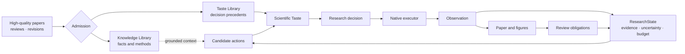

<p align="center">
  
</p>

<h1 align="center">SciTaste</h1>

<p align="center"><strong>SciTaste: Improving Autonomous Research through Scientific Taste</strong></p>

<p align="center">
  An independent, evidence-native system for deciding what an autonomous researcher should do next.
</p>

<p align="center">
  <a href="https://github.com/Dustzx/SciTaste/actions/workflows/ci.yml"></a>
  
  <a href="LICENSE"></a>
  
</p>

<p align="center">
  <a href="#quick-start">Quick start</a> ·
  <a href="#generation-as-content">Interface</a> ·
  <a href="#current-status">Status</a> ·
  <a href="docs/ARCHITECTURE.md">Architecture</a> ·
  <a href="docs/ROADMAP.md">Roadmap</a>
</p>

<p align="center">
  
</p>

SciTaste starts from a different premise: producing more hypotheses, experiments,
or prose is not enough. Autonomous research also needs a policy for judging
**which action is scientifically worthwhile now**, why it should be preferred,
what evidence could falsify it, and when the project should pivot or stop.

SciTaste is a first-party autonomous-research system. It owns the controller,
state, native executor, project runtime, paper/review loop, and user interface.
AutoResearchClaw is kept unmodified as an optional compatibility adapter and
external baseline; SciTaste does not require it to run.

> **Research status — 2026-09-11.** The software control plane and offline
> idea-to-paper machinery are substantially implemented. The current ICLR 2027
> manuscript is a venue-formatted research draft, not an accepted or
> publication-ready paper. Formal matched-system effectiveness experiments,
> verified native evidence lineage, and independent expert review remain pending.

## Why scientific taste?

High-quality papers, reviews, revisions, and outcomes contain more than facts.
They encode decisions: which problem was worth pursuing, which experiment was
diagnostic, which claim was too strong, and which revision actually resolved a
review concern.

SciTaste does not reduce that material to ordinary retrieval-augmented prompting:

1. source material enters through provenance, rights, and quality gates;
2. factual content becomes a **Knowledge Document**;
3. decision context, alternatives, rationale, and observed outcome become a
   candidate **Taste Case**;
4. only verified Taste Cases enter stage-aware precedent retrieval;
5. the Taste controller ranks explicit candidate actions under current evidence,
   uncertainty, scientific value, and budget;
6. later outcomes can become new precedents without erasing failures or negative
   results.



## Three primary innovations

| | Innovation | What changes | Authority boundary |
|---|---|---|---|
| 01 | **Scientific Taste** | Research quality becomes an inspectable decision policy over candidate actions, evidence, precedent, uncertainty, and cost. | The controller selects; an executor cannot silently choose the next global action. |
| 02 | **Generation as Content** | The interface is generated around the project, question, and evidence instead of forcing every task into one dashboard. | A planner may select only server-owned components and cannot invent state, code, URLs, or execution authority. |
| 03 | **Tool Intelligence** | Typed model nodes make rigid tools adaptive at semantic decision points such as classification, planning, and bounded repair. | Model output remains a proposal until deterministic schema, evidence, budget, and execution gates accept it. |

The enabling ideas include nonlinear research control, Evidence-to-Idea,
Knowledge/Taste dual memory, evidence-native writing and figures, reviewer-driven
research obligations, project-owned provenance, and substrate-independent
execution. See the full [Innovation Map](docs/INNOVATION_MAP.md).

## One project, one research lineage

SciTaste maintains a canonical `ResearchState` rather than a one-way sequence of
generated files. Discovery, evidence, communication, and review can move forward
or route backward while preserving the reason and artifacts for every transition.

```text
Discover ──► Evidence ──► Communicate ──► Review
    ▲            │              ▲            │
    └─ reformulate / pivot ◄────┴─ new evidence obligation
```

- **Discovery:** literature landscape, intuition, falsifiable hypothesis,
  diagnostic probes, reformulation, mature ideas, and portfolio selection.
- **Evidence:** claim/evidence graphs, gap planning, controlled measurement,
  interpretation criticism, contradiction retention, and pivot routing.
- **Communication:** evidence-gated narrative, Writing Taste, venue profiles,
  claim-linked editable figures, TeX/PDF packaging, and artifact lineage.
- **Review:** structured concerns, author responses, evidence-bearing obligations,
  reviewer verification, and independent pre-submission gates.

## Generation as Content

The local UI is a research workspace rather than a credential form or a single
chat page:

```text
Project index
└── Project home
    ├── lifecycle, runs, papers, evidence, blockers
    └── research topic / conversation
        ├── immutable question page
        ├── immutable follow-up page
        └── evidence-bound generated surface
```

Each project has a stable homepage. Each topic owns a multi-turn conversation,
and every question creates a refreshable deep link. Quick intents and free-form
questions can change grouping, emphasis, and evidence views, but the browser
receives only closed renderer data. On loopback, the main page requires no
credential; non-loopback access remains explicit and authenticated.

The public-facing project page is a separate dependency-free static site under
[`site/`](site/README.md). It intentionally has no access to research state,
model endpoints, or the authenticated Generation as Content runtime.

## Quick start

Requires Python 3.11 or newer. API access and the AutoResearchClaw submodule are
optional.

```bash
git clone https://github.com/Dustzx/SciTaste.git
cd SciTaste
python3.11 -m venv .venv
.venv/bin/pip install -e '.[dev]'

# Deterministic offline research trajectory
.venv/bin/scitaste run demo --output outputs/demo --seed 7

# Complete offline test suite
.venv/bin/pytest
```

Inspect `outputs/demo/research_state.json`, `decisions.jsonl`, and
`demo_summary.json` to see the selected actions and state transitions.

Create a project and open its local workspace:

```bash
.venv/bin/scitaste project init \
  --project-id my-project \
  --title "My research project" \
  --research-direction "A falsifiable research direction"

.venv/bin/scitaste project status --project-id my-project
.venv/bin/scitaste ui serve --outputs-root outputs
```

Open <http://127.0.0.1:8765>. The browser establishes its protected loopback
session automatically; no token is entered in the main interface.

Run the integrated offline Discovery → Evidence → Communication → Figure path:

```bash
.venv/bin/scitaste run full \
  --config configs/workflows/full_offline_v1.yaml \
  --project-id my-full-project \
  --run-id offline-full-seed-07 \
  --paper-directory offline-full-seed-07-integration-fixture \
  --seed 7 --output outputs
```

This validates integration and produces a project-owned Markdown/TeX/PDF bundle.
Its short paper is deliberately classified as an `integration-fixture`, not as
scientific evidence or a publication-quality manuscript. Native measured code
execution requires a working Bubblewrap installation on Linux. See the
[Full Workflow guide](docs/FULL_WORKFLOW.md).

## Project-owned outputs

`outputs/INDEX.md` is the human-readable catalog. The canonical unit is always a
project—not an isolated stage directory:

```text
outputs/projects/<project-id>/
├── PROJECT.json            # revisioned project identity and current pointers
├── runs/<run-id>/          # inputs, state, stages, decisions, receipts, evidence
├── papers/<paper-id>/      # Markdown, TeX, PDF, assessments, manifest
├── reviews/<review-id>/    # packets, reports, responses, verification
├── evaluations/            # protocols, cells, results, and blockers
├── surfaces/               # content-addressed project views
└── .generative-ui/         # project-owned conversations and UI audits
```

Generated outputs, model responses, datasets, papers, and secrets are intentionally
ignored by Git. Refresh the local catalog with:

```bash
.venv/bin/python scripts/catalog_outputs.py outputs
```

See [Output Layout](docs/OUTPUT_LAYOUT.md) and
[Project Runtime](docs/PROJECT_RUNTIME.md).

## Current status

| Capability | Engineering state | Scientific boundary |
|---|---|---|
| Native controller and project runtime | Implemented and offline tested | Engineering correctness is not an effectiveness result. |
| Discovery and Evidence loops | Implemented with deterministic and bounded semantic paths | Open-ended scientific quality requires held-out evaluation. |
| Native execution | Content-bound CPU execution and explicit local GPU profiles | Portability, broader workloads, and external replication remain pending. |
| Writing, figures, and paper build | Evidence contracts, venue taste, editable figures, Markdown/TeX/PDF, and submission checks | Passing structural gates does not establish paper quality or claims. |
| Review loop | Typed packets, concerns, responses, obligations, and verification paths | Independent expert reviews for the current paper are incomplete. |
| Generation as Content | Project homes, multiple conversations, immutable turns, bounded layout planning, and responsive browser probes | Counterbalanced human usability and decision-quality studies remain pending. |
| Formal system evaluation | Comparison regimes, resource dossiers, exact acquisition approval, cell plans, and budget gates implemented | No current formal result establishes SciTaste's headline improvement claim. |

The substantive tracked manuscript is
**SciTaste: Improving Autonomous Research through Scientific Taste** at
[`manuscripts/scitaste/main.md`](manuscripts/scitaste/main.md). Local venue builds
live beneath the self-development project and are intentionally excluded from
Git. Read the [ICLR 2027 evaluation plan](docs/ICLR_2027_EVALUATION_PLAN.md) and
[experiment decision dossier](docs/EXPERIMENT_DECISION_DOSSIER.md) before
interpreting any pilot result.

## Models, APIs, and external systems

The default installation and CI are offline. Live access requires both a declared
configuration and an explicit caller gate; secrets are read from environment
variables and never stored in YAML, output receipts, or source code.

- **API backends:** OpenAI-compatible providers, including tracked Zhipu and
  DeepSeek examples, with exact request/response recording and bounded usage.
- **Local model:** an opt-in Transformers backend for the existing
  Qwen3-VL-2B-Instruct checkpoint; no model is downloaded implicitly.
- **GPU execution:** content-bound profiles default-deny GPU access and expose
  only verified devices with measured GPU-hour accounting.
- **External frameworks:** AutoResearchClaw is an optional pinned adapter and
  baseline. Unavailable systems remain declared unavailable rather than replaced
  with fake implementations.

No formal API, data acquisition, remote GPU, or external-system execution is
triggered by installation, tests, UI startup, or dry-run commands. See
[API Providers](docs/API_PROVIDERS.md),
[Data Acquisition Approval](docs/DATA_ACQUISITION_APPROVAL.md), and
[External System Adapters](docs/EXTERNAL_SYSTEM_ADAPTERS.md).

## Documentation

| Guide | Purpose |
|---|---|
| [Roadmap](docs/ROADMAP.md) | Milestones, exit gates, current work, and deferred proof |
| [Architecture](docs/ARCHITECTURE.md) | Component boundaries and system invariants |
| [Innovation Map](docs/INNOVATION_MAP.md) | Scientific Taste, Generation as Content, and Tool Intelligence |
| [Generative UI](docs/GENERATIVE_UI.md) | Project homes, conversations, surfaces, security, and interaction contracts |
| [Native Execution](docs/NATIVE_EXECUTION.md) | First-party executor, admission, sandbox, and evidence ownership |
| [Paper Review Loop](docs/PAPER_REVIEW_LOOP.md) | Paper packets, review obligations, responses, and verification |
| [Writing Taste](docs/WRITING_TASTE.md) | Venue/archetype guidance and evidence-first writing constraints |
| [Evaluation Prelaunch](docs/EVALUATION_PRELAUNCH.md) | Hash-bound model, task, adapter, budget, and authorization gates |
| [Project specification](PROJECT_SPEC.md) | Authoritative product and research requirements |

## Development

```bash
make install
make check
```

Contributions should preserve deterministic decision logging, state compatibility,
project ownership, and the distinction between integration evidence and scientific
claims. See [CONTRIBUTING.md](CONTRIBUTING.md).

SciTaste is released under the [MIT License](LICENSE).
