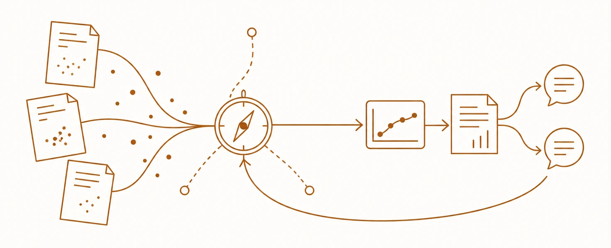
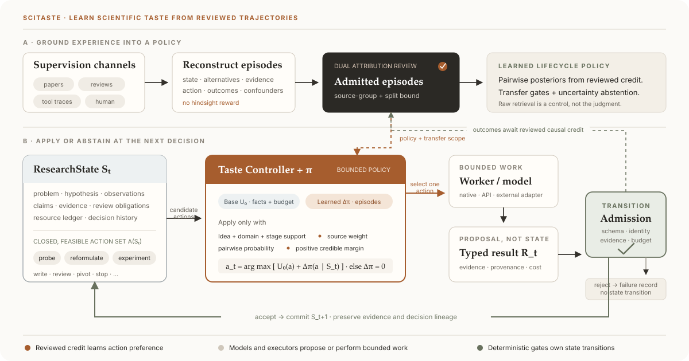

<p align="center">
  
</p>

<h1 align="center">SciTaste</h1>

<p align="center"><strong>SciTaste: Improving Autonomous Research through Scientific Taste</strong></p>

<p align="center">
  An independent, evidence-native system for deciding what an autonomous researcher should do next.
</p>

<p align="center">
  
  <a href="LICENSE"></a>
  
</p>

<p align="center">
  <a href="https://dustzx.github.io/SciTaste/">Project page</a> ·
  <a href="#quick-start">Quick start</a> ·
  <a href="docs/INNOVATION_MAP.md">Innovations</a> ·
  <a href="docs/ARCHITECTURE.md">Architecture</a> ·
  <a href="docs/ROADMAP.md">Roadmap</a>
</p>

<p align="center">
  
</p>

Generating more ideas, experiments, and prose is not enough. Autonomous research
also needs judgment: **which action is scientifically worthwhile now, why, what
could falsify it, and when to revise, pivot, or stop**.

SciTaste makes that judgment an explicit part of the research system. It owns the
controller, project state, native executor, evidence loop, paper/review loop, and
local interface. It runs without AutoResearchClaw; the unchanged upstream project
is available only as an optional compatibility adapter and external baseline.

> **Research preview.** The offline system and idea-to-paper control plane are
> implemented. Formal matched-system experiments and independent expert review
> are still pending, so no current result establishes SciTaste's headline
> effectiveness claim.

## Why scientific taste?

High-quality papers, reviews, revisions, and outcomes contain decision experience,
not just passages to retrieve. SciTaste abstracts that experience into verified
**Taste Cases**, then judges candidate actions in the context of current evidence,
uncertainty, scientific value, and budget.

<p align="center">
  <a href="manuscripts/scitaste/assets/fig1-scitaste-control.svg">
    
  </a>
</p>

<p align="center"><sub>Figure 1 of the working paper. Select the figure to inspect it at full size.</sub></p>

Retrieval helps locate relevant material; it is a transport layer, not the whole
mechanism. The core problem is learning **why a decision was good in context** and
whether that precedent should transfer to the present project. Failed and negative
outcomes remain visible instead of being rewritten as success.

## What SciTaste adds

| | Capability | Role |
|---|---|---|
| 01 | **Scientific Taste** | Ranks explicit research actions using evidence, precedent, uncertainty, value, and cost. |
| 02 | **Generation as Content** | Generates bounded project views around the current question instead of forcing every task into one dashboard. |
| 03 | **Tool Intelligence** | Uses typed model nodes at semantic decision points while deterministic gates retain execution authority. |

Together these support a nonlinear research loop:

```text
Discover ──► Evidence ──► Communicate ──► Review
    ▲            │              ▲            │
    └──── reformulate / pivot ◄──┴────────────┘
```

## What works today

- A first-party controller and revisioned `ResearchState` select and explain the
  next action.
- Discovery, evidence, writing, figures, review obligations, and backward routing
  share one project lineage.
- The native executor records content-bound runs, budgets, receipts, and evidence;
  optional CPU, local-GPU, API, and external-framework paths fail closed.
- Paper builds produce Markdown, TeX, PDF, assessments, and claim-linked artifacts.
- The local Generation-as-Content workspace provides project homes, conversations,
  immutable turns, and evidence-bound generated surfaces.
- Every run, paper, review, evaluation, and interface surface belongs beneath one
  `outputs/projects/<project-id>/` tree.
- Shared API/GPU definitions and changing observations live above projects in a
  secret-free catalog plus the local `outputs/resources/` registry.

See the [architecture](docs/ARCHITECTURE.md) for component boundaries and the
[innovation map](docs/INNOVATION_MAP.md) for the full research argument.

## Quick start

Python 3.12 is required. The supported interpreter range is intentionally fixed
to the 3.12 minor series so local development, CI, and formal runtime preparation
share one language environment. The default path is deterministic and offline;
it needs no API key, model download, GPU, or external research framework.

```bash
git clone https://github.com/Dustzx/SciTaste.git
cd SciTaste
python3.12 -m venv .venv
.venv/bin/pip install \
  -c requirements/python312-dev-study.lock \
  -e '.[dev,study]'

.venv/bin/scitaste run demo --output outputs/demo --seed 7
```

Inspect `outputs/demo/research_state.json`, `decisions.jsonl`, and
`demo_summary.json` to see the selected actions and transitions.

Create a project and open its local workspace:

```bash
.venv/bin/scitaste project init \
  --project-id my-project \
  --title "My research project" \
  --research-direction "A falsifiable research direction"

.venv/bin/scitaste ui serve --outputs-root outputs
```

Open <http://127.0.0.1:8765>. Loopback access establishes its protected browser
session automatically; the main page has no credential field.

For the complete offline Discovery → Evidence → Communication → Figure path, use
the [full-workflow guide](docs/FULL_WORKFLOW.md). The checked-in constraints file
defines the canonical Linux Python 3.12 development and study environment. GPU
workloads retain experiment-specific immutable runtime profiles because CUDA and
model dependencies are part of the measured condition rather than the repository
control environment.

## Research status

| Area | Current boundary |
|---|---|
| System | Core offline paths are implemented and tested; engineering correctness is not a scientific effectiveness result. |
| Evaluation | The resource-independent ICLR program is scientifically coherent. Its exact source/method proposal bundle is ready for owner review, while downloads, adapters, model choice, power, human review, and formal runs remain gated. |
| Paper | The tracked ICLR 2027 manuscript is a working research draft, not a publication-ready or accepted paper. |
| Review | Typed model and reviewer-obligation loops exist; independent expert review of the current manuscript remains incomplete. |

The manuscript source is
[`manuscripts/scitaste/main.md`](manuscripts/scitaste/main.md). Before interpreting
any pilot, read the [ICLR 2027 evaluation plan](docs/ICLR_2027_EVALUATION_PLAN.md)
and [core experiment strategy](docs/ICLR_2027_EXPERIMENT_STRATEGY_V1.md), then
inspect the
[machine-checkable evidence program](configs/evaluation/programs/iclr2027_scitaste_evidence_program_v1.yaml)
and its [no-run review package](configs/evaluation/programs/iclr2027_evidence_review_package_v1.yaml),
and [experiment decision dossier](docs/EXPERIMENT_DECISION_DOSSIER.md).

## Models and integrations

Live backends are opt-in and require an explicit caller gate. SciTaste supports
OpenAI-compatible APIs, an optional local Transformers backend, content-bound GPU
profiles, and declared external-system adapters. Secrets are read from environment
variables and are not stored in source, YAML, or output receipts.

## Documentation

| Start here | Then go deeper |
|---|---|
| [Architecture](docs/ARCHITECTURE.md) | [Scientific Taste and the innovation map](docs/INNOVATION_MAP.md) |
| [Full workflow](docs/FULL_WORKFLOW.md) | [Generation as Content](docs/GENERATIVE_UI.md) |
| [Output layout](docs/OUTPUT_LAYOUT.md) | [Native execution](docs/NATIVE_EXECUTION.md) |
| [Roadmap](docs/ROADMAP.md) | [Evaluation prelaunch gates](docs/EVALUATION_PRELAUNCH.md) |
| [Taste corpus curation](docs/TASTE_CORPUS_CURATION.md) | [Matched/placebo qualification](docs/TASTE_CORPUS_PAIRING.md) |
| [Shared compute and model assets](docs/COMPUTE_RESOURCES.md) | [ICLR 2027 experiment strategy](docs/ICLR_2027_EXPERIMENT_STRATEGY_V1.md) |

## Development

```bash
make install
make check
```

See [CONTRIBUTING.md](CONTRIBUTING.md) before opening a pull request. SciTaste is
released under the [MIT License](LICENSE).
