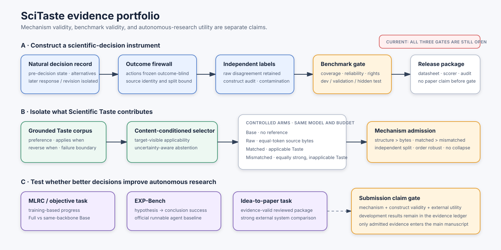

# SciTasteBench

SciTasteBench is an evaluation subsystem, not the SciTaste control framework. It
depends only on the fixed-candidate backend contract and can fail independently
without blocking research-state execution.

## Publication role and current status

SciTasteBench is the paper's internal measurement instrument for Scientific
Taste. It tests whether grounded decision experience improves scientific choices;
external suites such as MLRC-Bench separately test whether those choices produce
objective research progress. Neither role can substitute for the other.



The concrete ICLR study matrix, case anatomy, causal arms, formal population
floor, and external benchmark division are summarized in
[`SCITASTEBENCH_ICLR27_STUDY_DESIGN.md`](research/SCITASTEBENCH_ICLR27_STUDY_DESIGN.md).
Its second figure makes the six decision contexts and the source-to-principle,
principle-to-decision, outcome-to-learning, and external-outcome links explicit.

The figure is also an evidence-admission rule. SciTasteBench must establish the
mechanism and the validity of its decision instrument; an external scorer-owned
benchmark must establish autonomous-research utility. Development runs remain in
the evidence ledger and may change the method, but they do not enter the main
submission as effectiveness results. One favorable internal table cannot authorize
the broad claim in the working title.

## Independent confirmation result and method consequence

The first source-group-disjoint confirmation reserve was executed on 2026-09-17.
It used 28 previously unreleased dual-AI-agreement decisions from 28 target source
groups, 36 fixed development precedents, zero target--precedent source-group
overlap, equal 256-token contexts, and declared plus reversed candidate order.
One adaptive-allocation item was excluded before execution because the development
corpus contained no same-family precedent; it was not reassigned to make the
population look complete.

The development signal did **not** replicate. Order-consistent accuracy was 60.7%
for Base, 57.1% for token-matched raw evidence, 46.4% for matched Taste, and 67.9%
for mismatched Taste. Matched minus raw was -10.7 points; matched minus mismatched
was -21.4 points (six paired regressions, no improvements; two-sided exact paired
test 0.03125). The order-averaged matched-minus-mismatched estimate was -12.5
points with a case-resampled 95% interval from -23.2 to -3.6 points. The exact
analysis is retained under
`outputs/projects/scitaste-self-development/evaluations/scitastebench-natural-contrastive-confirmation-v2/`.

This result retires deterministic same-family precedent assignment as a Scientific
Taste mechanism. The old compiler called a precedent "matched" when it shared a
broad judgment family, then selected it by a stable hash; it did not establish
target-content applicability. The next mechanism must learn or infer applicability
from target-visible state, card applicability/reversal conditions, and uncertainty,
with an abstention option. The 28-case reserve is now consumed failure evidence.
Any revised selector must be developed elsewhere and evaluated on a new untouched
split; rerunning these cases cannot become confirmation.

### Revised selector development result

The revised path has now been exercised on that consumed reserve.  It replaces
family-plus-hash assignment with Qwen3-Embedding-0.6B broad retrieval, a
target-visible applicability model, three-candidate shards, explicit abstention,
and deterministic source-de-duplicated merging.  This fixed the main interface
failure but did **not** recover a Scientific Taste effect.

In
`evaluations/scitastebench-deliberative-development-v5/`, 53 of 56 selector
invocations were structurally valid.  The selector recommended a precedent-backed
action in 7 declared-order and 11 reversed-order cases.  Yet it changed the Base
action only once and twice respectively, producing zero improvements and three
regressions.  Full-policy accuracy was 57.1%/67.9% versus Base 60.7%/75.0%;
order-consistent accuracy was 53.6% versus 60.7%.

Two follow-up decision paths tested whether the failure came from treating the
selector as an action override.  The selected principles were instead returned to
the frozen decision model, first as principles plus boundaries
(`scitastebench-deliberative-context-development-v6`) and then as complete
contrastive source experiences
(`scitastebench-deliberative-context-development-v7`).  Both produced the same
result: no declared-order change, one reversed-order regression, and no improvement
over Base.  These remain ignored development artifacts, not manuscript results.

The new selector is therefore operational but scientifically inactive on this
population.  A fresh confirmation split remains closed.  The next benchmark work
is not another retriever or prompt sweep: it is to admit action-identifiable cases
with counterfactual boundary twins, verify that abstractions preserve the source's
decision-relevant contrast, and then require matched applicability to beat an
equal-quality mismatched pool before freezing new targets.

### State-conditioned control-packet update

The current method no longer treats a fluent Taste card as the intervention.
It compiles selected precedents into a typed, state-bound control packet that
cites the exact current facts satisfying each applicability condition, maps the
precedent onto feasible actions, exposes signed action adjustments, and abstains
without a unique positive margin. The same packet is now accepted by the native
controller, and formal boundary-pair schema 1.1 recomputes scalar utility from
registered evidence-value, information-gain, resource-cost, and claim-risk
components.

On the 13 consumed development pairs, this packet improved mean pair regret over
Base (0.296 versus 0.360) but remained worse than equal-token Raw (0.221) and the
Mismatched control (0.200). Pair success was 0.385 versus 0.462 for both controls.
The exact development report is under
`outputs/projects/scitaste-self-development/evaluations/scitastebench-boundary-decision-development-v4/`.
This result fails the mechanism gate, keeps hidden confirmation closed, and
locates the next problem in construct validity and applicability/action mapping
rather than context length or interface plumbing.

The current ICLR design authority is the
[`four-layer protocol`](research/SCITASTEBENCH_FOUR_LAYER_PROTOCOL_V1.md). It
connects source and abstraction evidence (SA), held-out decisions (D), delayed
credit learning (L), and complete externally scored projects (P). The layers
retain separate endpoints rather than producing an opaque aggregate benchmark
score. The first development release is 36 natural cases across six scientific
decision-context families and all seven orthogonal Taste judgment families; the
existing 24-target Track-A pilot covers only four legacy context families and
therefore remains consumed development evidence rather than being silently
promoted.

The original natural construction pool contains 273 candidate review-to-revision
episodes from 81 source groups: 196 ARIES candidates from 42 groups and 77 F1000
candidates from 39 groups. Together they expose three observed domain or
publisher-subject strata, but those strata are not yet independently confirmed.
An independently acquired validation reserve now adds 97 candidate trajectories
from 60 source-group-disjoint works: twenty natural ARIES dev review/reply cases
and 77 F1000 cases from forty previously unseen works. ARIES reply-to-edit
association is heuristic and explicitly not a human label. The combined local
construction inventory is therefore 370 candidates across 141 source groups,
but the original calibration sample and the new reserve remain separately
identified rather than being pooled after inspection.

The current no-call development intake has materialized one deterministic,
outcome-hidden representative for each of those 141 groups at
`outputs/projects/scitaste-self-development/evaluations/scitastebench-four-layer-development-intake-v1/`.
It records 101 groups with no exact prior Track-A role and 40 groups already used
as a target or precedent, spans computing (62), ecology (39), and public health
(40), and keeps later outcomes in a separate scoring-only vault. This establishes
screening capacity, not 36 accepted cases: source aliases, family coverage,
utility construction, AI-panel labels, and the target/precedent allocation still
have to close before a development suite exists.

The first two outcome-blind caseability screens have now executed over all 101
unused groups. Qwen3.8-Max proposed 84 eligible cases using 132,812 tokens and
USD 2.096904; GLM-5.3-Flash proposed 77 using 135,621 tokens and a conservative
USD 1.648568 liability ceiling. Both calls used thirteen fixed zero-retry
batches. Long identifier copying caused four raw batches per model to fail the
strict receipt even though all semantic objects validated. A model-independent
normalizer therefore binds identity by the unique candidate-ID position for
*all* batches, retains every raw receipt, changes no semantic field, and records
five Qwen identity corrections plus three removed GLM envelope fields and
eleven nullifications of fields that GLM attached to explicitly ineligible
items.

This is still screening rather than benchmark admission. Among the 71 cases
both models considered eligible, they agreed on the decision-context family for
only 40. Resource-allocation coverage is the limiting construct: Qwen proposed
four such cases, GLM proposed one, and none agree. Hypothesis coverage is also
thin. A third model must adjudicate only disputed or scarce-family candidates;
the project must not hand-relabel experiment-design cases merely to satisfy the
six-per-family quota.

The disagreement-only panel has completed: 21 cases with exact
context-and-judgment agreement and 11 jointly excluded cases bypassed further
model judgment, while DeepSeek V4.1 Flash adjudicated 69 disputes in nine fixed
batches. The calls consumed 118,780 tokens at a recorded USD 0.0481. A
deterministic normalizer projected the selected primary proposal back onto the
frozen schema without changing any choice. This produced 81 eligible records,
but not the intended balanced release: problem selection has four records and
resource allocation three, below the six-per-family target. The shortage is
retained rather than repaired by hand relabelling.

The first natural development suite freezes 36 outcome-blind action pairs from
65 cases on which GLM-5.3-Flash and Qwen3.8-Max independently agree after seeing
the isolated later record. It spans computing, ecology, and public health, but
is unbalanced: resource allocation has one case and adaptive allocation is
absent. The suite is therefore development evidence with
`not_human_review=true`, not a formal benchmark release.

DeepSeek V4.1 Flash has executed this suite under Base, raw precedent, matched
abstracted Taste, and mismatched abstracted Taste in both candidate orders. The
288 decisions yield order-consistent accuracies of 50.0%, 55.6%, 47.2%, and
58.3%, respectively: a case counts as correct only when both candidate orders
are correct. Per-order averages and a case-resampled interval remain secondary
diagnostics in the machine-readable analysis. Matched Taste uses 74,902 input
tokens across both orders versus 247,470 for raw precedent, so it compresses
context without yet preserving selective value. The result directs the next
method iteration toward contrastive applicability boundaries rather than more
retrieval. Exact local artifacts are under
`outputs/projects/scitaste-self-development/evaluations/scitastebench-natural-development-v5/`.

That development suite and the consumed 28-case confirmation reserve are not a
formal SciTasteBench release. They lack complete family coverage, independent
construct validation, public-release clearance for the exact source text, and a
hidden test population. Until those gates close, the paper must call them internal
natural decision sets rather than presenting their case count as a benchmark scale.

The candidates are not benchmark items or gold outcomes. A source enters a
formal population only after the applicable domain, quality, privacy,
decision-family, grounded-abstraction, attribution, and decision-episode
integrity gates accept it. Missing human staffing is not one of those gates.
The active deadline route uses operationally final, identity-distinct AI
reviewers and records
`reviewer_kind=ai`, `not_human_review=true`; it does not claim human or expert
validity. A valid rejection closes its review node while keeping the source out;
malformed or incomplete evidence remains fail-closed.

Version 3 already specifies the title-critical H1/H2 conditions: same-source raw
evidence, same-source abstracted Taste, and source-disjoint mismatched Taste under
token and source-identity controls. AI-panel judgments are mechanism/proxy
measurements; held-out objective scorers own title authority. The lifecycle
evidence program extends this instrument with H2b
autonomous precedent selection and H3 reviewed delayed-credit learning. Their
software and evidence contracts do not authorize a paper claim until real
source-group-disjoint cases, treatments, splits, model identity, power, exact AI
panel identities, and objective claim-admission contracts are frozen.

Version 1 remains a synthetic engineering acceptance suite. It is useful for
testing metrics and condition isolation but is not publication-effectiveness
evidence. The historical Version 2 compiler retains a separate human-labelled
curation boundary: natural
cases contain no answer, source groups are disjoint from the evaluated Taste
precedents, rubric and precedent corpora are content-addressed, and at least two
independent human labels are compiled into the hidden expert distribution.
Model-generated labels are structurally inadmissible to that historical human
estimand. The active v2 AI-finality route is a distinct nonhuman estimand and
must not relabel its output as human evidence.

## Version 1 protocol

The initial suite contains eight independent synthetic decisions across all six
task families: Idea, Experiment, Evidence, Writing, Review, and Visual. Every
case presents exactly two fixed actions and keeps the expert preference outside
the backend request.

Each case is evaluated under five isolated conditions:

| Condition | Additional information visible to the backend |
|---|---|
| `base` | decision context only |
| `knowledge_rag` | retrieved factual context only |
| `taste_library` | retrieved decision principle only |
| `taste_critics` | independent critic feedback only |
| `full_scitaste` | knowledge, taste, critics, and controller state |

Formal v2 adds `taste_placebo`, which supplies mismatched source-disjoint Taste
precedents. It also runs declared and reversed candidate order as separate
content-bound arms. The order arms are repeated measurements of the same case,
not additional sample size.

The condition name and augmentation content are part of the request fingerprint.
Exact recordings therefore cannot be replayed under a different condition.

## Metrics

The report provides pairwise preference accuracy, expert agreement, mean
confidence, Brier score, expected calibration error, and wrong-level decision
rate. It also reports:

- per-family metrics;
- future-year, cross-venue, and cross-domain slices;
- role-normalized style invariance and paraphrase consistency;
- paired improvements, regressions, and unchanged cases relative to `base`.

Ranking correlation is explicitly unavailable because the v1 backend returns
one selection from a pair rather than a complete ranking. Research-yield and
matched-budget outcome measures belong to Phase 9 and are also marked
unavailable instead of being inferred from preference judgments.

For the current four-layer protocol these legacy metrics are diagnostic. The
five registered paper endpoints are abstraction value gain, transfer
specificity gap, budgeted decision regret, delayed-credit learning gain, and
objective research progress per matched budget. In particular, an AI-panel
preference cannot be relabelled as objective scientific progress, and a loaded
Taste policy cannot receive causal credit unless it changes an eligible action
that is carried through execution to a hidden outcome.

These metrics support a top-tier argument only through their joint causal
signature. The frozen interpretation asks whether structure beats the same raw
bytes, matched applicability beats equally strong but mismatched advice,
delayed credit beats both no update and shuffled credit, and the resulting
behavior shifts objective progress per budget. Progress--budget frontiers,
valid-evidence yield, selective regret, behavior-change rate, and invalid claims
explain *how* an effect arises; they are not pooled into a convenient composite.
The full positive, null, and boundary interpretation table is in the four-layer
protocol.

Suite schema `4.0` adds the D-layer execution fields without changing legacy
suite hashes: six decision-context families, the orthogonal seven-family Taste
judgment label, explicit AI-panel label authority, a content-bound hidden
utility for every candidate action, and optional abstention actions. The runner
reports mean budgeted decision regret and paired regret reduction; a v4 formal
suite fails closed unless all contexts and judgments are covered and its
mechanism contexts use dual-AI-reviewed curation.

## Headline eligibility

Every case declares whether it may enter headline metrics. Self-referential cases
are rejected if marked headline-eligible. The SciTaste self-iteration case is a
dogfooding record and is not part of this independent suite.

The committed synthetic selections are designed to exercise metric sensitivity,
including errors and condition deltas. Their scores are acceptance results for
the evaluation pipeline, not measurements of a real model or evidence that
SciTaste is effective.

## Running the suite

Offline deterministic acceptance:

```bash
.venv/bin/scitaste benchmark run \
  --backend scripted \
  --suite configs/benchmark/scitastebench_v1.yaml \
  --output outputs/scitastebench-phase8-offline \
  --seed 7
```

Run only selected conditions by repeating `--condition`; `base` is mandatory so
the comparison remains controlled:

```bash
.venv/bin/scitaste benchmark run \
  --backend scripted \
  --condition base \
  --condition full_scitaste \
  --output outputs/scitastebench-base-full
```

For a real model, select `--backend openai-compatible` for a provider or
`--backend local-transformers` for an existing local checkpoint, pass the
matching config, and use `--record` to preserve exact request/response pairs.
Tests and default commands never contact a provider or load a checkpoint.
Generated reports remain ignored; only aggregate acceptance manifests and hashes
are committed.

Inspect and compile a natural v2 curation package with:

```bash
.venv/bin/scitaste benchmark curate \
  --package /path/to/curation.yaml \
  --evidence-root /path/to/frozen-evidence \
  --output /path/to/scitastebench_v2.yaml
```

Compilation fails closed on missing or drifted natural-source/rubric/Taste
corpus bytes, inconsistent rubric versions, fewer than two labels, duplicate
reviewers, unnecessary or unresolved adjudication, source-group leakage, or
the formal 120-case/three-domain/six-family floor. The full scientific and GPU
contract is in
[`SCITASTEBENCH_V2_CURATION_GOVERNANCE_V1.md`](research/protocols/SCITASTEBENCH_V2_CURATION_GOVERNANCE_V1.md).

## Capability-boundary diagnostics

Every Base/Full report partitions headline cases into paired successes, system
recoveries, system regressions, and shared failures. This is diagnostic evidence:
a shared Base/Full failure is not automatically a model limitation, and a Full
recovery does not establish a hard model ceiling.

To distinguish model-specific candidates from shared suite failures, run the
identical suite and seed with a second model, then compare the two saved reports:

```bash
.venv/bin/scitaste benchmark attribute \
  --primary-report outputs/model-a/benchmark_report.json \
  --comparator-report outputs/model-b/benchmark_report.json \
  --output outputs/model-a-vs-model-b
```

The command rejects different suite hashes or seeds. A Base failure is labelled a
model-limit candidate only when the comparator succeeds on that identical case;
shared failures remain unassigned. The output remains a controlled diagnostic,
not a causal or effectiveness claim.
