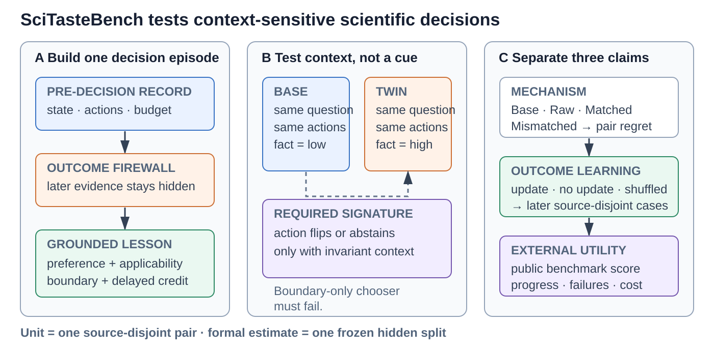
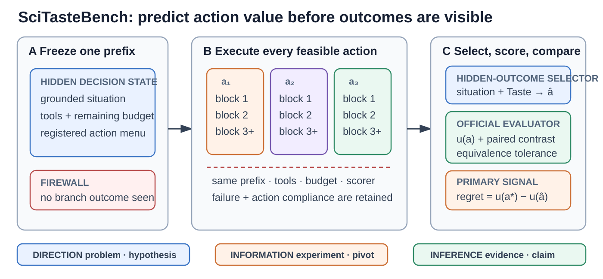

# SciTasteBench and external validation: ICLR 2027 study design

Status: current scientific design; formal data have not been opened. A frozen
30-proposal, source-disjoint feasibility test admitted zero reconstructed
boundary pairs and therefore killed that data-unit design under its preregistered
gate. SciTasteBench now uses scorer-owned executable objective forks as its
primary unit. All reconstructed pairs and the earlier negative selector runs
remain consumed development material rather than paper results. No confirmation
population is frozen.

SciTasteBench is the mechanism instrument for the SciTaste method paper. It is
not intended to make SciTasteBench itself the entire contribution, and it cannot
establish end-to-end autonomous-research utility by itself.

## The three questions the paper must answer

1. Can high-quality research records be converted into compact, source-grounded
   decision principles with explicit applicability and reversal boundaries?
2. Do those principles improve a new scientific decision because they apply to
   its current evidence state, rather than because they add tokens or generic
   advice?
3. When a Taste-induced choice is executed, does it improve an externally scored
   research outcome under the same budget?

SciTasteBench answers the first two questions and tests feedback learning. Public
Auto Research tasks answer the third. A positive result in either evaluation is
insufficient without the other.

## The released unit is an executable fork, not a question

The observational unit is one real pre-decision execution prefix with a frozen
scientific action menu. The same prefix, tools, remaining budget, and scorer are
forked across every feasible action; each branch is executed with independent
seeds. The evaluated selector sees the prefix but never branch outcomes. This
measures whether conditional Taste predicts objective action value rather than
whether it agrees with a benchmark-author preference.

Each released fork contains the following machine-checkable objects:

| Object | Required content | Why it exists |
|---|---|---|
| Frozen prefix | task locator, environment and code hash, state hash, task-cluster identity | provenance and split integrity |
| Scientific state | exact-span grounded situation dimensions and visible constraints | tests the proposed representation rather than topic retrieval |
| Action menu | 2--5 stable action semantics executable from the same prefix | common support and meaningful alternatives |
| Branch contract | identical tools/budget, at least three seeds per action, intention-to-treat failures | estimates action value without survivorship bias |
| Objective utility | official scorer, common scale, direction, and practical-equivalence tolerance | regret without author-defined labels |
| Transfer audit | source-to-target boundaries and explicit action-semantic bindings | matched versus mismatched attribution |
| Audit record | replicate results, contamination probe, construction manifest, hashes, split | uncertainty and reproducibility |

The formal schema and fail-closed readiness checks live in
`scitaste.evaluation.scientific_situation_transfer` as
`FormalObjectiveForkSituationCase` schema 3.0. Reconstructed pair schemas remain
available only to replay the consumed failure audit.

Schema 3.0 closes the experimental unit before any selector is evaluated. It
content-binds the task locator, prefix state, environment, code, executable
action definitions, tool/budget/horizon contract, paired seed blocks, scorer
identity and scale transform, split, construction manifest, contamination
audit, action-compliance traces, and every branch result. Each seed block must
contain exactly one branch for every registered action. A hash-shaped string
without the corresponding bound payload is not admissible evidence.

### Population and splits

The first objective-fork development population has a floor of **30 fresh
prefixes from at least ten independent task clusters**, covers all three primary
axes, and requires common support for every registered action. It is used only
to estimate action identifiability, within-fork variance, task-cluster variance,
and the smallest useful effect. Those quantities freeze the validation and
hidden-test size once; the hidden population is never opened to repair the
method. At most one split contains a task cluster. No branch seed, prefix,
candidate order, paraphrase, condition, or model repetition counts as a new
independent task.

The formal population is authorized only if development establishes nontrivial
action separation beyond practical equivalence, complete intention-to-treat
branch accounting, action diversity, and support on every primary axis. If the
available tasks cannot supply that population, SciTasteBench is reported as a
development instrument and the paper relies on untouched external benchmarks;
sample counts are never filled by relabeling review comments or by treating
correlated prefixes as independent.

As of 2026-09-18, exact local compilation has produced the following
construction inventory.  These are candidates, not benchmark cases, and no row
is counted as formal evidence:

| Source population | Domains | Candidate decisions | Independent source groups |
|---|---|---:|---:|
| ARIES test review--edit records | machine learning | 196 | 42 |
| ARIES dev review--reply reserve | machine learning | 102 | 102 |
| F1000 development population | ecology, public health | 77 | 39 |
| F1000 validation reserve | ecology, public health | 77 | 40 |
| F1000 confirmation buffer | ecology, public health | 80 | 38 |
| **Disjoint union** | **three domains** | **532** | **261** |

All ten pairwise cross-population overlap counts are zero under canonical
source-group identities. The raw inventory now exceeds the 240-group
construction floor. Twenty of the 102 ARIES dev groups are a subset previously
used in development, leaving 82 newly materialized groups in that source; other
development exposure is tracked separately. The formal split remains closed:
the acquisition-count gate is satisfied, but context coverage, atomic-pair
construction, rights, expert construct validity, and source-disjoint allocation
are not. Repeated prompts, comments from the same paper, paraphrases, or
candidate orders cannot repair any of those gates.

### Coverage audit and source-specific roles

The source deficit is not only numerical. Two outcome-hidden development
screens independently found that the natural review records are concentrated in
experiment, evidence, and claim decisions. The Qwen screen admitted 56
decisions: 23 experiment, 11 evidence, 12 claim, but only 3 problem, 3
hypothesis, and 4 resource/pivot/stopping decisions. The GLM screen admitted 52:
15 experiment, 13 evidence, 15 claim, 6 problem, 3 hypothesis, and **zero**
resource/pivot/stopping decisions. These are screening diagnostics on partly
different candidate sets, not agreement statistics or benchmark results. They
show that acquiring more undifferentiated peer-review records would increase
sample count without repairing lifecycle coverage.

SciTasteBench therefore uses three scientific-decision axes rather than treating
six context tags as unrelated miniature benchmarks:

| Primary axis | Operational contexts | Scientific question |
|---|---|---|
| Direction | problem value; hypothesis and falsifiability | Is this question or conjecture worth pursuing under the present evidence? |
| Information | experiment and confounds; resource, pivot, continue, or stop | Which feasible action has the highest value of information per constrained resource? |
| Inference | evidence interpretation; claim and review response | What conclusion is warranted, and how strongly may it be stated? |

The formal population remains stratified over all six tags, but the three axes
are the powered reporting strata. This prevents six underpowered headline tests
while preserving the important distinction between, for example, experiment
choice and stopping. The hidden-test allocation and context minima will be
recomputed from validation attrition before freezing rather than filled by
relabeling abundant claim decisions.

Source types have different evidential roles and are never pooled into a single
sample count:

| Source stratum | Current qualified material | Admissible role | Missing condition for formal use |
|---|---|---|---|
| Human scientific record | ARIES and F1000 review--revision histories | candidate natural states, especially the Inference axis | pair-blinded domain-expert construct labels, utility elicitation, and valid atomic twins |
| Executed research attempts | CodeScientist metadata at commit `778b146a...` | development precedents for Direction and Information | ideas are model-generated; no independent quality label, objective utility contract, or chronological pivot/stopping trace |
| Ordered agent traces | OpenDiscoveryTrace core trajectories at dataset commit `b112204c...` | development diagnostics for error-triggered revision and recovery | agent-generated actions, incomplete human validation, simulated retrieval, and no controlled alternative-action outcomes |
| Scorer-owned executable forks | new forks collected on frozen public benchmark tasks | objective Information-axis cases and treatment mediation | both feasible actions must be executed from an identical prefix under matched budgets and scored by the external evaluator |

The locally compiled CodeScientist population contains 50 independent idea
groups and 543 bound experiment attempts: 232 completed and 311 failed or
interrupted. Repeated attempts remain correlated observations within one idea,
not 543 benchmark samples. All 50 ideas have an expert filter note, but those
notes do not constitute per-decision utility labels. The local
OpenDiscoveryTrace audit confirms that its 372 core frontier-model trajectories
contain 1,536 steps and 323 non-empty revision triggers; this is useful process
material, but a model's self-recorded revision is not expert scientific Taste.
Both sources are therefore quarantined from hidden formal targets.

For scorer-owned executable forks, a benchmark state is frozen immediately
before a consequential hypothesis, experiment, or pivot decision. Two feasible
continuations receive the same remaining budget and independent random seeds;
the official task scorer supplies the terminal outcome. This stratum supplies
objective action utility and tests whether the Taste recommendation mediates
real progress. It does **not** replace the natural-record stratum or the external
system comparison: the former measures human-grounded construct validity, while
the latter evaluates an unconstrained end-to-end agent on untouched public
tasks.

### Fresh-source construction audit and revised admission gate

The full ARIES dev reserve produced 102 independent source groups. Ten overlap
with prior Track-A roles, so the outcome-hidden intake exposed 92 unused groups
to caseability screening. A complete DeepSeek screen of 68 groups admitted 60
candidate decisions, but again found no resource/pivot/stopping case. From the
highest-leverage, lowest-ambiguity decisions, an axis-stratified construction
attempt selected 24 sources. It produced 13 schema-1.1 pairs with registered
four-component utilities: 7 Direction, 4 Information, and 2 Inference pairs.

An independent Qwen reviewer, with expected labels, utilities, state roles, and
later outcomes hidden, admitted **zero of 13**. Nine pairs were solvable by a
boundary-cue shortcut and six retained source prose that contradicted one
counterfactual state; one otherwise plausible pair could not establish which
state was natural from the source. A second reviewer was not called because it
cannot turn zero first-review admissions into two-review consensus. This is a
consumed construction audit, not a benchmark or method result.

The failure changes the construction gate. A proposed pair must now provide two
views in addition to its full state:

1. a **fact-neutral shared context**, produced by explicitly removing every
   source sentence that asserts either boundary value while retaining those
   spans in provenance; and
2. a **boundary-only control** containing the action menu and changed fact but
   none of the registered invariant scientific context.

Pair-blinded review must recover the reversal from the full states, while a
frozen strong boundary-only chooser must fail to recover it reliably. The
reviewer must cite at least two invariant facts needed to distinguish the
actions. “Baseline missing implies add baseline,” “evidence present implies
retain,” and analogous one-cue mappings are rejected even when their labels are
scientifically plausible. This converts shortcut resistance from a prose
instruction into an observable contrast: the benchmark measures a
fact-by-context interaction rather than reaction to a highlighted fact.

No formal split is opened until a new source-disjoint cohort passes this gate.
The 13 rejected pairs and all API responses remain development provenance and
will not be repaired into validation or hidden test.

### Feasibility kill test before benchmark scaling

The next benchmark action is not automatic expansion to 120 pairs. It is a bounded construction
test on 30 newly selected, source-group-disjoint proposals: ten candidates on each primary axis,
at least three candidates in each of the six operational contexts, at least three domains, and at
least three proposed action-to-abstention boundaries. The proposals remain consumed development
regardless of outcome. Constructor outputs, review order, and boundary-only controls are frozen
before the independent reviews.

Scaling is authorized only if all of the following preregistered gates pass:

1. at least 12 of 30 proposals survive both deterministic validation and two independent,
   pair-blinded construct reviews without editing after review;
2. every survivor changes exactly one atomic fact, retains unchanged action semantics and
   feasibility, contains no state contradiction, and names at least two invariant facts that both
   reviewers say are necessary for the preference;
3. reviewer agreement on admission and preferred action is reported on all 30 proposals, with
   disagreement retained; AI reviewers used during this test remain proxy reviewers and do not
   create a human- or expert-labelled claim;
4. a frozen boundary-only chooser performs no better than its registered chance/abstention
   baseline, while the full-context review exceeds the boundary-only result by at least 20
   percentage points on admitted proposals;
5. the preferred action is unchanged under equal component weights for at least 80% of survivors,
   no preferred action is Pareto-dominated, and ambiguous/tied utilities produce abstention rather
   than a forced label; and
6. survivors cover all three primary axes and all six operational contexts. A zero cell is a
   source-design failure, not permission to relabel another context.

Failure of gates 1--5 kills the reconstructed-boundary-pair route for the ICLR submission and
moves SciTasteBench's primary utility labels to scorer-owned executable forks. Failure only of gate
6 triggers source-specific acquisition for the missing contexts; it does not justify collecting
more undifferentiated peer-review records. Passing this test establishes construction feasibility,
not method effectiveness and not final sample size.

**Gate outcome (2026-09-18).** The frozen cohort completed all 30 constructor
requests: ten Direction, ten Information, and ten Inference proposals, with five
proposals in every operational context and 30 independent source groups. Zero
proposal passed the deterministic admission contract. The most common failures
were source prose that made a twin internally contradictory, fact-presence cues
that directly disclosed the action, missing exact invariant grounding, and
incomplete constructor payloads. The preregistered minimum-yield and coverage
gates therefore fail before proxy review. The reconstructed-pair route is closed;
no repair, model swap, or additional API call may promote this cohort. The frozen
decision is recorded in
`evaluations/scitastebench-feasibility-gate-v1/GATE.json`. This is a benchmark-
design result in the consumed-development ledger, not evidence about SciTaste's
effectiveness and not a main-paper result.

### Consumed construction audit (not a result)

The first live construction deliberately used only the outcome-hidden screening
projection. Three proposal runs yielded 26 unique candidates, but the same
constructor changed its admission decisions when the seed changed. Two further
model reviewers therefore saw randomized `state_1`/`state_2` order, the original
pre-decision record, and the frozen action menu, while the proposed preferred
actions, utilities, role names, rationale, and observed outcomes were withheld.

Requiring both reviewers to accept the construct, recover the natural state from
the source, and independently reproduce the registered action flip retained 13
pairs. They span all six contexts and three domains, but only one hypothesis and
one resource-allocation pair survived. This is evidence that the construction
protocol needs targeted replacement cases and later human/domain-expert
validation; it is not evidence that SciTaste works. The AI reviews are disclosed
as proxy judgments and cannot satisfy the formal expert-label requirement.

A later context-isolated audit accepted none of these 13 pairs unchanged: six
require reconstruction and seven should be rejected. Eleven twins inherit prose
that contradicts the registered fact change, some fact changes are compound,
all states force an action, scalar utilities lack a component contract, and
explicit boundary/action wording permits cue-following shortcuts. The full
13-pair population is therefore consumed. Formal construction starts from new,
source-disjoint material rather than editing these cases into a hidden split.

### Two benchmark tracks after the feasibility gate

The release has two related but non-interchangeable tracks:

1. **Objective Fork Judgment.** Choose or abstain at a real executable prefix.
   Every feasible action is executed under the same remaining budget and
   independent seeds. The official task scorer supplies the action-value target;
   the primary measurements are regret, ranking quality, selective risk, and
   invariance to action order and nuisance paraphrase.
2. **Outcome Learning.** Observe reviewed delayed credit from earlier source
   groups, update the Taste policy, and decide on later source-disjoint forks.
   The reviewed update must beat both no-update and shuffled-credit controls.

Objective Fork Judgment establishes whether the representation predicts which
scientific action actually improves an independently scored task. Outcome
Learning establishes whether earlier outcomes improve that judgment. Natural
review/revision records remain a coverage and construct-audit source, never the
utility-label authority. Neither track alone establishes end-to-end
competitiveness; untouched external tasks own that endpoint.

## Paper type and evidence boundary

The target submission is a **method paper with a new diagnostic instrument**, not
a benchmark paper with a small method attached.  SciTaste is the method;
SciTasteBench makes its otherwise vague central construct measurable.  This gives
the paper two coupled contributions without allowing either to validate itself:

- SciTasteBench tests whether the proposed mechanism learns grounded principles,
  transfers them only when their boundaries fit, abstains otherwise, and improves
  after delayed outcome credit;
- scorer-owned public tasks test whether those changed choices produce better
  autonomous-research outcomes outside the benchmark authors' definitions.

This division follows the strongest recent evaluation pattern.  Accepted
benchmark papers use broad, independently scored task populations: MLE-bench has
[75 competition environments](https://proceedings.iclr.cc/paper_files/paper/2025/hash/7e3767db483c942b883eb4f8cfb74e31-Abstract-Conference.html),
while EXP-Bench has
[461 experiment tasks from 51 papers](https://proceedings.iclr.cc/paper_files/paper/2026/hash/c411f5b2d9c55f1685e72db224ad8b0e-Abstract-Conference.html).
Research-agent evaluations instead use a smaller number of expensive environments
with objective progress, time/compute curves, and retained failures, as in
[RE-Bench](https://proceedings.mlr.press/v267/wijk25a.html).  A 120-case internal
decision study alone therefore cannot justify an end-to-end Auto Research claim.

## What one SciTasteBench case contains

Each case is one real, outcome-hidden executable research fork:

- a content-hashed execution prefix and pre-decision scientific state;
- two or more stable action semantics feasible from that identical prefix;
- one visible remaining budget shared by every action;
- at least three independent continuations per action, with failures retained by
  the intention-to-treat contract;
- a common, scorer-owned utility scale, practical-equivalence tolerance, and
  replicate-level outcomes isolated from the evaluated selector; and
- one task-cluster identity that controls all train/development/test placement.

The six contexts are problem value, hypothesis falsifiability, experiment and
confounds, evidence interpretation, resource/pivot/stopping, and claim/review
response. One source group contributes at most one formal pair.

The action menu must be diagnostic. A population in which almost every item asks
the system to “perform more analysis” cannot distinguish scientific taste from a
generic caution prior and is rejected before formal evaluation.

The old floor of 120 reconstructed pairs is retired with that route. The new
sample size is a task-clustered power decision, not a prompt count. Development
must first establish action identifiability on 30 fresh prefixes from at least
ten independent tasks. The formal task and fork counts are then frozen once from
development variance and the smallest effect worth detecting. Action seeds,
candidate-order repetitions, and multiple prefixes from one task are correlated
measurements; none inflates the independent task count.

## Construction and release contract

The benchmark is incomplete until all of the following objects exist for every
formal case:

1. a licensed task, content-hashed prefix, and task-cluster identity;
2. an outcome-hidden state and stable feasible action set at one abstraction level;
3. identical remaining tools and budget for every branch;
4. at least three independent continuations per action, including failed branches;
5. one common scorer-owned utility contract and practical-equivalence tolerance;
6. exact-span grounded situation dimensions, applicability boundaries, and
   action-semantic mappings fixed before outcomes are opened;
7. replicate-level scorer outputs, uncertainty, split assignment, contamination
   probe, and immutable content hashes.

Formal targets, precedent sources, development cases, and self-development
records are split by task cluster. Exact source text is released
only when its license permits it; otherwise the release must contain reproducible
source locators and a deterministic reconstruction recipe.  An AI-reviewed set is
reported as AI-reviewed and cannot be called expert- or human-labelled.

## The causal comparisons

All decision conditions use the same generator model, action menu, visible state,
and context budget.

| Condition | What is added | What it rules out |
|---|---|---|
| Base | nothing | standalone model ability |
| Equal-token raw | source evidence bytes | benefit from more factual context |
| Stage/status kNN | coarse lifecycle features and objective outcomes | benefit from any low-dimensional case policy |
| Generic outcome memory | outcome-bearing reflections without Taste dimensions or boundaries | benefit from remembering successes and failures at all |
| Matched Taste | a grounded principle whose boundaries fit the target state | value of decision abstraction and transfer |
| Mismatched Taste | an equally strong principle outside its applicability boundary | generic “good research” advice and context priming |

Equal-token is necessary but insufficient. Raw, Matched, and Mismatched are
also balanced by source identity, factual propositions, answer polarity,
explicit action recommendation, lexical overlap, and formatting. Mismatched is
chosen by a frozen minimum-distance matching rule subject to a verified boundary
violation; it is never hand-picked after observing a model answer. Each state is
run under two candidate orders and two meaning-preserving nuisance paraphrases.
These four calls are repeated measurements and are averaged before fork-level
analysis.

Branch execution is paid once per fork, not once per selector. Every selector
chooses from the same frozen menu and is evaluated against the same hidden
replicate outcomes, so these simple baselines add API inference rather than a
large GPU Cartesian product. The expensive external end-to-end study retains a
smaller four-role matrix.

Utility is not authored by SciTasteBench reviewers. Every branch is scored by
the task's official evaluator on one shared scale; failed or missing executions
receive the preregistered intention-to-treat value. A practical-equivalence
tolerance prevents negligible score noise from becoming a preferred action.
Cost is controlled first by the identical branch budget and then reported as a
separate score--cost curve rather than hidden inside arbitrary benchmark-author
weights. Policy abstention (zero Taste adjustment) and an explicit scientific
stop action are separate events and receive separate coverage and regret
accounting.

The primary decision signature is not accuracy alone. It requires all of:

- lower decision regret for Matched than Base and equal-token raw;
- a positive Matched-minus-Mismatched specificity gap;
- calibrated abstention when no precedent satisfies its boundaries;
- higher top-action accuracy and rank correlation with objective branch values;
- lower regret on source-disjoint tasks after reviewed outcome updates than after
  no update or shuffled credit;
- invariance to action presentation order.

The primary endpoint is mean **objective action regret per executable fork** on
the common scorer scale. The co-primary mechanism endpoint is task-clustered
top-action selection: choose any action within the registered practical-
equivalence set, or abstain when common support is insufficient. Secondary
endpoints are Spearman ranking correlation over actions, Matched-minus-
Mismatched specificity, intervention coverage and precision, abstention
risk--coverage, candidate-order disagreement, nuisance-paraphrase invariance,
failure rate, and score versus cost. A paired randomization test and task-cluster
bootstrap operate on independent tasks; Holm correction covers the three
registered Matched contrasts. The smallest effect of interest and hidden
population are frozen once from development/validation task-cluster variance.
The analysis never treats action seeds, prefixes, or model calls as independent
tasks.

### One treatment interface across local and external evaluation

The claim-bearing method is the typed `TasteControlPacket`, not an arbitrary
prompt containing a Taste card. For every decision it binds selected precedents
to exact current-state facts, embeds the complete frozen action semantics, maps
precedents onto those actions, records aligned and opposed support, and exposes
deterministic per-action adjustments.
A unique positive adjustment is required for intervention; tied or non-positive
support abstains. The same packet must be consumed by SciTasteBench decisions and
external research trajectories. On executable tasks the recommendation is
converted into a self-hashed research-action directive before code generation;
the downstream model may implement that action but cannot replace it with a
different high-level intervention. A development arm that receives only a
generic abstraction or raw source is labelled accordingly and cannot be renamed
Full SciTaste after its score is observed.

Formal forks use `FormalObjectiveForkSituationCase` schema 3.0. Before value
estimation, every source action is mapped to the exact content-bound target
action definition by an outcome-hidden adjudicator. Incomplete, low-confidence,
post-selection, or definition-drifting maps are rejected. The selector then
requires common action support and gates on the paired best-minus-runner-up
contrast uncertainty, combining paired seed-block variance with between-task
variation. Marginal standard errors cannot stand in for this contrast. Tied or
practically equivalent forks remain in risk--coverage and abstention analyses;
they are not silently discarded or converted into supervised winners. Legacy
reconstructed pairs and single-rollout development forks cannot be promoted.

The earlier family-plus-hash matcher failed the independent 28-case reserve:
Matched underperformed Mismatched. That is retained as a falsification of the old
selector. The revised selector must first pass on consumed development cases and
then be evaluated once on a newly frozen, source-disjoint split.

## Learning from outcomes

Feedback learning compares no update, reviewed delayed-credit update, and
shuffled-credit update on later source-disjoint decisions. A credible learning
result requires the reviewed update to beat both controls. It must also retain a
trace from the changed policy state to a changed eligible action, executed work,
and the later outcome. More memory or different prose without an action change is
not credited as learning.

## External Auto Research evaluation

At least one **peer-reviewed, community-owned external end-to-end Auto Research benchmark**
is mandatory. SciTaste already has two suitable accepted routes: MLRC-Bench and
MLR-Bench were both accepted to the NeurIPS 2025 Datasets and Benchmarks Track. AAAR-1.0 adds
accepted component tasks, but cannot replace an end-to-end trajectory benchmark. The minimum
defensible ICLR portfolio therefore separates component competence, local mechanism attribution,
objective research progress, and final-package quality:

| Evaluation | Endpoint | Primary comparison | Role |
|---|---|---|---|
| AAAR-1.0 (ICML 2025) | official equation-inference, experiment-design, and paper-weakness metrics | Full SciTaste, same-backbone Native Base, equal-context Raw/RAG | external component check; not evidence of complete autonomous research |
| MLRC-Bench (NeurIPS 2025 D&B) | objective competition-score improvement and progress per GPU/API budget | Full SciTaste, same-backbone Native Base, equal-context Raw/RAG, official MLAB scaffold under the same research-agent model | accepted external benchmark, executable research, causal context control, and competitiveness |
| MLR-Bench (NeurIPS 2025 D&B) | stagewise and final-package quality with invalid-result accounting | Full, Native Base, Raw/generic memory, official MLR-Agent | accepted external idea-to-paper evaluation |
| SciTasteBench | objective action regret, action-value ranking, abstention, and delayed-credit learning | Base, equal-token raw, Matched Taste, Mismatched Taste | internal mechanism attribution rather than external competitiveness |

MLRC-Bench and MLR-Bench are both ML-research evaluations; they cannot by
themselves support an unqualified cross-domain autonomous-research claim.
ScienceAgentBench (ICLR 2025) is therefore the required external scope check if
the broad title is retained: its 102 tasks were derived from 44 peer-reviewed
papers in four scientific disciplines. It enters through its unchanged official
tasks and execution-based evaluator, never through a local imitation.
The official code is now pinned at commit `c26e151e...`, and the current
Hugging Face `verified` split is pinned at dataset commit `9c6e96c9...`; exact
inventory confirms 102 tasks across computational chemistry, GIS,
bioinformatics, and psychology/cognitive science. The verified execution archive
is not yet available locally because the official SharePoint link currently
returns HTTP 401 to anonymous download. Therefore neither a development run nor
the broad title is authorized. The pinned acquisition record is
`configs/evaluation/acquisition/scienceagentbench_verified_v1.yaml`; no local
substitute scorer is permitted.
EXP-Bench (ICLR 2026) remains a strong experiment-integrity comparison, but its
461 tasks are drawn from AI research papers and therefore do not substitute for
cross-domain evidence. If ScienceAgentBench cannot be run comparably, the title
and claims are narrowed to ML research agents.

MLRC-Bench is the immediate objective route because its competition score directly
measures improvement over a supplied baseline under a compute limit.  Its own
study reports only [9.3% of the baseline-to-top-human gap closed by the strongest
tested agent](https://arxiv.org/abs/2504.09702), which makes it both difficult and
diagnostic.  MLR-Bench complements rather than replaces this result: package
quality and review cannot prove that the proposed method improved a hidden task
score.

The external-system comparison and the internal causal comparison have different
purposes. Full versus Native Base, under the same backbone and budget, attributes
an effect to Taste. Agent Laboratory, MLR-Agent, or another accepted runnable
system establishes competitiveness. A best-native external comparison is useful
but model-confounded and is labelled accordingly.

Consequently the all-task MLRC comparison contains four roles rather than a
large Cartesian grid: Full SciTaste, same-model Native Base, equal-context
Raw/RAG, and the benchmark's real runnable MLAB method. A three-task mechanism
subset additionally includes shuffled-credit/no-boundary Taste and a generic
reflection-memory baseline. The formal endpoint covers all seven official tasks;
the first Temporal Action Localisation task is consumed development and cannot
select a favourable task subset. The task is the generalization unit. At least
three paired agent seeds are run unless a development-derived power calculation
requires more; seed-level calls never inflate task count. Benchmark adapters may
translate files and telemetry, but may not reimplement a blocked method or
substitute a new scorer.

The ordering is deliberate. AAAR can be run first because it is cheaper and checks whether the
same frozen method improves recognized scientific subtasks. MLRC is the first claim-bearing
end-to-end route because its scorer owns the objective. MLR-Bench then checks the broader
idea-to-paper package. A positive AAAR score cannot authorize a paper claim when MLRC/MLR remain
blank, and a positive self-authored SciTasteBench result cannot replace either external route.

MLRC reports the official endpoint, normalized improvement over its supplied
baseline, best-so-far score versus cumulative GPU/API cost, invalid-run rate,
wall time, and tokens. It also reports Taste intervention rate, action-divergence
rate, and a trace from intervention to executed patch and score. Failures remain
in an intention-to-treat analysis. MLR-Bench reports stagewise and final-package
quality, evidence validity, fabrication and invalid-result rates, repeated
blinded judging, and cost.

## Evidence buffer

Engineering runs, parser fixes, consumed development splits, and adapter smoke
tests remain in the evidence ledger.  They may change the method and disclose a
failure, but their effect sizes cannot enter the main result table.  A result
moves into the manuscript only after the exact method, split, model, budget,
scorer, failure policy, and analysis are frozen before outcomes are opened.  A
method revision after seeing a split consumes that split.

This buffer is why the current negative 28-case result is useful without becoming
the paper's headline: it falsifies family-plus-hash matching and forces a
content-conditioned selector, while reserving a new population for the first
valid estimate of that revised selector.

The first real MLRC Perception task is also consumed development. Its upstream,
Native Base, Raw/RAG, and abstraction-guided arms are used to debug the official
runtime and estimate variance. Because the abstraction-guided arm predates the
shared `TasteControlPacket` treatment, it is not Full SciTaste regardless of its
score. The later packet-directed arm completed the objective at 0.239387 after
one full training run and a scoring-only repair. It beat upstream and Raw but
not the same-runtime Native Base (0.241669), so this consumed task closes the
treatment-to-score loop without passing the method gate. Formal MLRC comparisons
begin only after a revised packet-producing method is frozen across all
conditions and tasks.

Evidence moves through four irreversible states:

| State | May change code or protocol? | May select a method? | May enter a main paper result? |
|---|---:|---:|---:|
| engineering / smoke | yes | no | no |
| consumed development | yes | yes, provisionally | no |
| frozen validation | no for that population | once | appendix/design only |
| hidden confirmation | no | no | yes, including null and failed runs |

This is the required buffer between system development and manuscript evidence.
An engineering score is never upgraded merely because it is favorable.

## Minimum external portfolio for the method claim

SciTasteBench is necessary but cannot be the only comparison. The method and
the measuring instrument share assumptions, so an internal win alone is
self-validating. The smallest defensible external portfolio is:

| Question | External route | Conditions | Primary evidence |
|---|---|---|---|
| Does Taste improve accepted scientific-reasoning subtasks? | official AAAR-1.0 tasks | Full, same-backbone Native Base, equal-context Raw/RAG | official subtask metrics, abstention, and cost |
| Does Taste improve executable research on an accepted external benchmark? | all seven official MLRC-Bench tasks after one development task | Full, same-backbone Native Base, equal-context Raw/RAG, official MLAB; at least three paired seeds | objective score gain, cost curve, failures, and active-intervention mediation |
| Does the complete research product improve on an accepted external benchmark? | ten frozen, source-disjoint MLR-Bench briefs | Full, Native Base, Raw/generic memory, official MLR-Agent | stagewise and final-package review with invalid-result accounting |
| Does the broad claim transfer beyond ML research? | unchanged official ScienceAgentBench tasks spanning four disciplines | Full, Native Base, official agent baseline | execution success, program correctness, cost, and failure accounting |
| Does Taste improve experiment integrity within AI research? | unchanged official EXP-Bench subset, only if its runtime and scorer qualify | Full, Native Base, official agent baseline | conjunctive hypothesis-to-conclusion success and failure accounting |

The same-backbone Full/Base pair identifies the effect of Taste. The external
system establishes competitiveness. Neither ScienceAgentBench nor EXP-Bench is
replaced by a local imitation if its official runtime is unavailable. The broad
title is retained only if the cross-domain ScienceAgentBench scope check runs;
otherwise the paper is explicitly about ML research agents. Seed count is
frozen from development variance before the formal run, with three paired seeds
as the minimum.

## Required paper figures and tables

The benchmark contribution is not visually complete until the manuscript shows:

1. the shared-prefix objective-fork anatomy and outcome firewall;
2. population coverage by context, task cluster, action menu, and execution
   status, with split and contamination audit;
3. per-fork action-value distributions with each method's chosen action and
   retained failures;
4. a task-clustered objective-regret interval and risk--coverage curve;
5. an outcome-learning curve against no-update and shuffled-credit; and
6. a separate external task table/plot with objective outcome, failures, cost,
   and behavior-change mediation.

The first item is a design figure. Items 2--6 are generated only from frozen
artifacts and remain blank rather than being populated with development scores.

## What belongs in the manuscript

Development runs guide the method and remain in the evidence ledger. They do not
fill the main result table. The paper should contain:

- this design figure and a benchmark datasheet summary;
- one main SciTasteBench mechanism table with uncertainty and negative controls;
- one external objective-progress table;
- one complete-package comparison with cost and failure accounting;
- ablations for raw versus abstracted reference, matched versus mismatched
  transfer, no-update versus shuffled credit, and Native Base versus Full;
- failure slices by decision context, domain shift, abstention, and budget.

There is deliberately no omnibus “SciTaste score.” Local mechanism validity,
feedback learning, external objective progress, package quality, and resource use
are separate estimands. Pooling them would make a favorable result impossible to
interpret.
