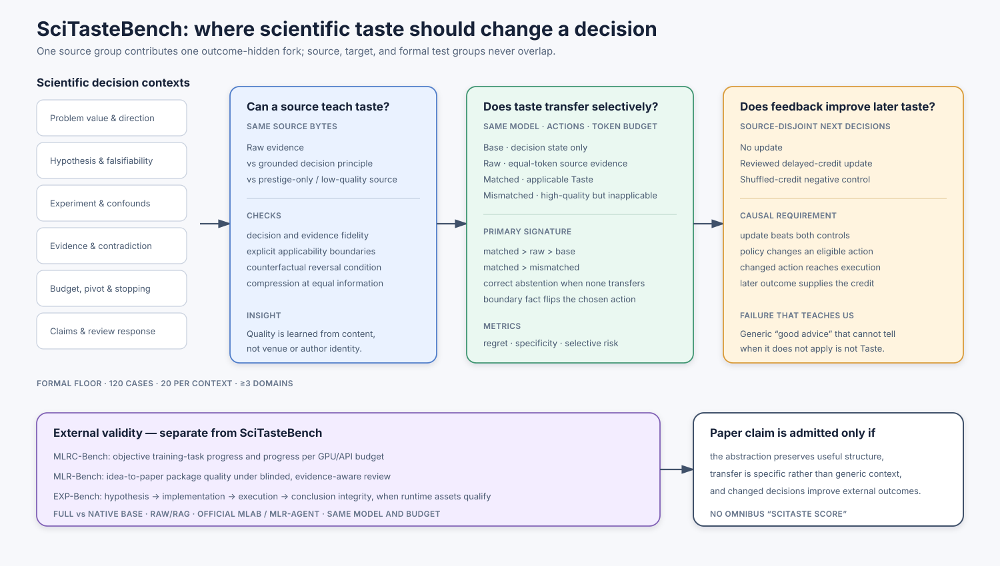
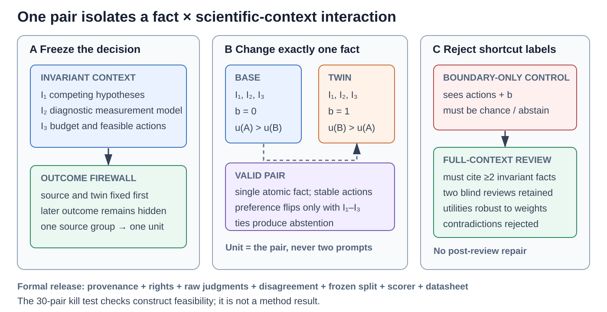

# SciTasteBench and external validation: ICLR 2027 study design

Status: current scientific design; formal data have not been opened. A first
outcome-hidden construction pass produced 26 unique candidate boundary pairs.
Independent label-hidden GLM and DeepSeek construct review admitted only 13, so
these cases are consumed development material rather than a paper result. The
revised selector made all 26 state-level applicability decisions protocol-valid,
but its best grounded representation still had higher mean regret than the
equal-token raw source and lower pair success than the mismatched control. This
falsifies the current abstraction as a confirmation candidate. No confirmation
population is frozen.

SciTasteBench is the mechanism instrument for the SciTaste method paper. It is
not intended to make SciTasteBench itself the entire contribution, and it cannot
establish end-to-end autonomous-research utility by itself.

## The three questions the paper must answer

1. Can high-quality research records be converted into compact, source-grounded
   decision principles with explicit applicability and reversal boundaries?
2. Do those principles improve a new scientific decision because they apply to
   its current evidence state, rather than because they add tokens or generic
   advice?
3. When a Taste-induced choice is executed, does it improve an externally scored
   research outcome under the same budget?

SciTasteBench answers the first two questions and tests feedback learning. Public
Auto Research tasks answer the third. A positive result in either evaluation is
insufficient without the other.

## The released unit is a boundary pair, not a question

The independent unit is one natural decision plus one **single-fact
counterfactual twin**. Topic, action menu, budget, writing style, and all
registered invariant facts remain fixed. Exactly one decision-relevant fact
changes, and that fact must reverse the preferred action or change action into
abstention. A pair is rejected when both states still reward the same generic
action. This directly tests the central claim that Taste is conditional rather
than a globally useful piece of advice.

Each released pair contains the following machine-checkable objects:

| Object | Required content | Why it exists |
|---|---|---|
| Natural source | attributable locator, content hash, license, source-group identity | provenance, release rights, split integrity |
| Frozen decision | outcome-hidden state, visible budget, 2--5 feasible actions | the actual judgment to be made |
| Boundary twin | one changed fact, all invariant facts, unchanged action identifiers | intervention on applicability rather than topic |
| Utility contract | per-action outcome, information, cost, and claim-risk rationale | regret rather than majority-label accuracy alone |
| Construct judgments | two independent raw judgments plus adjudication only on disagreement | validity and uncertainty without agreement filtering |
| Audit record | contamination probe, construction manifest, content hash, split | reproducible release and leakage analysis |

The schema and fail-closed readiness checks live in
`scitaste.benchmark.boundary_pairs`. They are separate from legacy development
suites so adding this design cannot silently change an old suite hash.

### Population and splits

The formal floor is **120 independent boundary pairs (240 decision states)**:
20 pairs in each of the six decision contexts, at least three scientific
domains, and at most one pair per source group. The planned split is 24
development, 24 validation, and 72 hidden-test pairs, stratified by decision
context and domain. Development is used for prompt and policy construction;
validation can choose one frozen method version; hidden test is opened once.
No candidate-order, paraphrase, condition, or model repetition counts as a new
independent item.

The 120-pair floor is not a post-hoc power claim. Before opening hidden test, the
minimum detectable paired-regret improvement is recomputed from development and
validation variance. If the resulting precision is inadequate, more
source-group-disjoint pairs are added without inspecting hidden-test outcomes.

### Consumed construction audit (not a result)

The first live construction deliberately used only the outcome-hidden screening
projection. Three proposal runs yielded 26 unique candidates, but the same
constructor changed its admission decisions when the seed changed. Two further
model reviewers therefore saw randomized `state_1`/`state_2` order, the original
pre-decision record, and the frozen action menu, while the proposed preferred
actions, utilities, role names, rationale, and observed outcomes were withheld.

Requiring both reviewers to accept the construct, recover the natural state from
the source, and independently reproduce the registered action flip retained 13
pairs. They span all six contexts and three domains, but only one hypothesis and
one resource-allocation pair survived. This is evidence that the construction
protocol needs targeted replacement cases and later human/domain-expert
validation; it is not evidence that SciTaste works. The AI reviews are disclosed
as proxy judgments and cannot satisfy the formal expert-label requirement.

### Two benchmark tracks

The release has two related but non-interchangeable tracks:

1. **Boundary Judgment.** Choose or abstain on base and twin states. It measures
   regret, correct reversal, selective risk, and invariance to action order and
   nuisance paraphrase.
2. **Outcome Learning.** Observe reviewed delayed credit from earlier source
   groups, update the Taste policy, and decide on later source-disjoint pairs.
   The reviewed update must beat both no-update and shuffled-credit controls.

Boundary Judgment establishes whether the representation and selector express
conditional scientific judgment. Outcome Learning establishes whether real
outcomes improve that judgment. Neither track claims that an autonomous research
project improved; external tasks own that endpoint.

## Paper type and evidence boundary

The target submission is a **method paper with a new diagnostic instrument**, not
a benchmark paper with a small method attached.  SciTaste is the method;
SciTasteBench makes its otherwise vague central construct measurable.  This gives
the paper two coupled contributions without allowing either to validate itself:

- SciTasteBench tests whether the proposed mechanism learns grounded principles,
  transfers them only when their boundaries fit, abstains otherwise, and improves
  after delayed outcome credit;
- scorer-owned public tasks test whether those changed choices produce better
  autonomous-research outcomes outside the benchmark authors' definitions.

This division follows the strongest recent evaluation pattern.  Accepted
benchmark papers use broad, independently scored task populations: MLE-bench has
[75 competition environments](https://proceedings.iclr.cc/paper_files/paper/2025/hash/7e3767db483c942b883eb4f8cfb74e31-Abstract-Conference.html),
while EXP-Bench has
[461 experiment tasks from 51 papers](https://proceedings.iclr.cc/paper_files/paper/2026/hash/c411f5b2d9c55f1685e72db224ad8b0e-Abstract-Conference.html).
Research-agent evaluations instead use a smaller number of expensive environments
with objective progress, time/compute curves, and retained failures, as in
[RE-Bench](https://proceedings.mlr.press/v267/wijk25a.html).  A 120-case internal
decision study alone therefore cannot justify an end-to-end Auto Research claim.

## What one SciTasteBench case contains

Each case is one natural, outcome-hidden research fork:

- the pre-decision scientific state;
- two or more feasible actions at the same level of abstraction;
- the visible budget and constraints;
- a scoring-only later record, isolated from the evaluated system;
- a panel distribution over actions and an explicit abstention judgment;
- one source-group identity that controls all train/development/test placement.

The six contexts are problem value, hypothesis falsifiability, experiment and
confounds, evidence interpretation, resource/pivot/stopping, and claim/review
response. One source group contributes at most one formal pair.

The action menu must be diagnostic. A population in which almost every item asks
the system to “perform more analysis” cannot distinguish scientific taste from a
generic caution prior and is rejected before formal evaluation.

The floor of 120 is a coverage constraint rather than a claim that 120 is
automatically powered.  The final case count is revised once, using only the
development-set paired-regret variance and the smallest effect worth detecting.
Candidate-order repetitions are repeated measurements of the same case; they do
not inflate the independent sample count.

## Construction and release contract

The benchmark is incomplete until all of the following objects exist for every
formal case:

1. a source-licensed, de-duplicated decision episode and source-group identity;
2. an outcome-hidden state and feasible action set at a common abstraction level;
3. an isolated later-outcome record and a registered utility vector;
4. applicability and reversal boundaries that cite source spans;
5. a counterfactual twin that changes one decisive fact and should change either
   the chosen action or the correct abstention;
6. independent judgments with raw disagreements retained, not only an adjudicated
   label; and
7. a contamination probe, split assignment, and immutable content hash.

Formal targets, precedent sources, development cases, counterfactual twins, and
self-development records are split by source group.  Exact source text is released
only when its license permits it; otherwise the release must contain reproducible
source locators and a deterministic reconstruction recipe.  An AI-reviewed set is
reported as AI-reviewed and cannot be called expert- or human-labelled.

## The causal comparisons

All decision conditions use the same generator model, action menu, visible state,
and context budget.

| Condition | What is added | What it rules out |
|---|---|---|
| Base | nothing | standalone model ability |
| Equal-token raw | source evidence bytes | benefit from more factual context |
| Matched Taste | a grounded principle whose boundaries fit the target state | value of decision abstraction and transfer |
| Mismatched Taste | an equally strong principle outside its applicability boundary | generic “good research” advice and context priming |

The primary decision signature is not accuracy alone. It requires all of:

- lower decision regret for Matched than Base and equal-token raw;
- a positive Matched-minus-Mismatched specificity gap;
- calibrated abstention when no precedent satisfies its boundaries;
- a correct action flip on counterfactual twins that change a decisive boundary
  fact while preserving topic and wording style;
- invariance to action presentation order.

The primary endpoint is mean **budgeted decision regret per boundary pair**,
averaging the base and twin utilities before aggregation. The co-primary
mechanism endpoint is pair success: both states correct, the required reversal
present, and both decisions order-consistent. Secondary endpoints are
Matched-minus-Mismatched specificity, abstention risk--coverage, nuisance
paraphrase invariance, and cost. Exact paired intervals or a source-group
bootstrap operate on pairs; the analysis never treats individual model calls as
independent samples.

The earlier family-plus-hash matcher failed the independent 28-case reserve:
Matched underperformed Mismatched. That is retained as a falsification of the old
selector. The revised selector must first pass on consumed development cases and
then be evaluated once on a newly frozen, source-disjoint split.

## Learning from outcomes

Feedback learning compares no update, reviewed delayed-credit update, and
shuffled-credit update on later source-disjoint decisions. A credible learning
result requires the reviewed update to beat both controls. It must also retain a
trace from the changed policy state to a changed eligible action, executed work,
and the later outcome. More memory or different prose without an action change is
not credited as learning.

## External Auto Research evaluation

At least one **peer-reviewed, community-owned external Auto Research benchmark**
is mandatory. SciTaste already has two suitable accepted routes: MLRC-Bench and
MLR-Bench were both accepted to the NeurIPS 2025 Datasets and Benchmarks Track.
The minimum defensible ICLR portfolio therefore uses three complementary
endpoints:

| Evaluation | Endpoint | Primary comparison | Role |
|---|---|---|---|
| MLRC-Bench (NeurIPS 2025 D&B) | objective competition-score improvement and progress per GPU/API budget | Full SciTaste, same-backbone Native Base, official/runnable agent baseline | accepted external benchmark, executable research, and competitiveness |
| MLR-Bench (NeurIPS 2025 D&B) | stagewise and final-package quality with invalid-result accounting | Full, Native Base, MLR-Agent or another runnable external system | accepted external idea-to-paper evaluation |
| SciTasteBench | paired regret, correct boundary reversal, abstention, and delayed-credit learning | Base, equal-token raw, Matched Taste, Mismatched Taste | internal mechanism attribution rather than external competitiveness |

EXP-Bench (ICLR 2026) and ScienceAgentBench (ICLR 2025) are useful reserve routes,
not prerequisites once MLRC-Bench and MLR-Bench are run correctly. EXP-Bench
enters only if an unchanged official runnable subset is qualified in time; its
experiment-integrity scorer must not be imitated locally. ScienceAgentBench tests
scientific-program generation rather than open-ended research improvement, so it
is less aligned with the headline claim than MLRC-Bench.

MLRC-Bench is the immediate objective route because its competition score directly
measures improvement over a supplied baseline under a compute limit.  Its own
study reports only [9.3% of the baseline-to-top-human gap closed by the strongest
tested agent](https://arxiv.org/abs/2504.09702), which makes it both difficult and
diagnostic.  MLR-Bench complements rather than replaces this result: package
quality and review cannot prove that the proposed method improved a hidden task
score.

The external-system comparison and the internal causal comparison have different
purposes. Full versus Native Base, under the same backbone and budget, attributes
an effect to Taste. Agent Laboratory, MLR-Agent, or another accepted runnable
system establishes competitiveness. A best-native external comparison is useful
but model-confounded and is labelled accordingly.

Consequently the smallest defensible external comparison contains three roles,
not a large Cartesian grid: Full SciTaste, same-model Native Base, and one real
runnable external method.  Repetitions are added only when the development pair
shows stochastic variance large enough to change the conclusion.  Benchmark
adapters may translate files and telemetry, but may not reimplement a blocked
method or substitute a new scorer.

## Evidence buffer

Engineering runs, parser fixes, consumed development splits, and adapter smoke
tests remain in the evidence ledger.  They may change the method and disclose a
failure, but their effect sizes cannot enter the main result table.  A result
moves into the manuscript only after the exact method, split, model, budget,
scorer, failure policy, and analysis are frozen before outcomes are opened.  A
method revision after seeing a split consumes that split.

This buffer is why the current negative 28-case result is useful without becoming
the paper's headline: it falsifies family-plus-hash matching and forces a
content-conditioned selector, while reserving a new population for the first
valid estimate of that revised selector.

Evidence moves through four irreversible states:

| State | May change code or protocol? | May select a method? | May enter a main paper result? |
|---|---:|---:|---:|
| engineering / smoke | yes | no | no |
| consumed development | yes | yes, provisionally | no |
| frozen validation | no for that population | once | appendix/design only |
| hidden confirmation | no | no | yes, including null and failed runs |

This is the required buffer between system development and manuscript evidence.
An engineering score is never upgraded merely because it is favorable.

## Minimum external portfolio for the method claim

SciTasteBench is necessary but cannot be the only comparison. The method and
the measuring instrument share assumptions, so an internal win alone is
self-validating. The smallest defensible external portfolio is:

| Question | External route | Conditions | Primary evidence |
|---|---|---|---|
| Does Taste improve executable research on an accepted external benchmark? | at least three MLRC-Bench tasks | Full SciTaste, same-backbone Native Base, one runnable research-agent baseline; one paired seed first | objective score gain and gain per GPU/API budget |
| Does the complete research product improve on an accepted external benchmark? | source-disjoint MLR-Bench briefs | Full, Native Base, MLR-Agent or another runnable external system | stagewise and final-package review with invalid-result accounting |
| Where does experiment integrity fail? | unchanged official EXP-Bench subset, only if its runtime and scorer qualify | Full, Native Base, official agent baseline | conjunctive hypothesis-to-conclusion success; secondary diagnostic only |

The same-backbone Full/Base pair identifies the effect of Taste. The external
system establishes competitiveness. EXP-Bench is not replaced by a local
imitation if its official runtime is unavailable. Start with one paired seed;
repetitions expand only when the observed stochastic variance could change the
conclusion.

## Required paper figures and tables

The benchmark contribution is not visually complete until the manuscript shows:

1. the source-to-boundary-pair anatomy and outcome firewall;
2. population coverage by context, domain, action transition, and label
   disagreement, with split and contamination audit;
3. a paired base-to-twin plot showing correct flips, failure modes, and
   abstentions for every method;
4. a risk--coverage curve and paired-regret interval for Boundary Judgment;
5. an outcome-learning curve against no-update and shuffled-credit; and
6. a separate external task table/plot with objective outcome, failures, cost,
   and behavior-change mediation.

The first item is a design figure. Items 2--6 are generated only from frozen
artifacts and remain blank rather than being populated with development scores.

## What belongs in the manuscript

Development runs guide the method and remain in the evidence ledger. They do not
fill the main result table. The paper should contain:

- this design figure and a benchmark datasheet summary;
- one main SciTasteBench mechanism table with uncertainty and negative controls;
- one external objective-progress table;
- one complete-package comparison with cost and failure accounting;
- ablations for raw versus abstracted reference, matched versus mismatched
  transfer, no-update versus shuffled credit, and Native Base versus Full;
- failure slices by decision context, domain shift, abstention, and budget.

There is deliberately no omnibus “SciTaste score.” Local mechanism validity,
feedback learning, external objective progress, package quality, and resource use
are separate estimands. Pooling them would make a favorable result impossible to
interpret.
