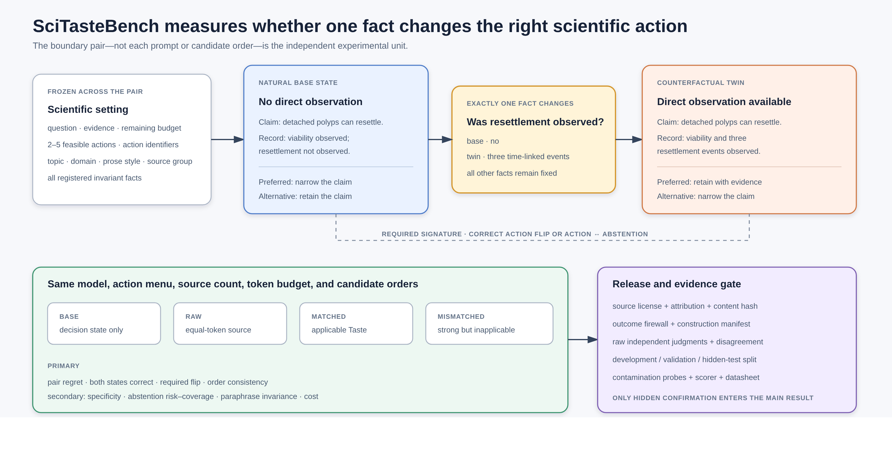

## Title
SciTaste: Improving Autonomous Research through Scientific Taste

# Abstract

Autonomous research agents can search, code, experiment, and write, yet these
capabilities do not determine *which* scientific move is worth making next. We
study this missing capability as **scientific taste**: a contextual preference
over consequential research decisions, learned from what was known when a
choice was made and what happened afterward. We introduce **SciTaste**, which
reconstructs scientific records into decision episodes containing the state,
feasible alternatives, delayed outcome, and boundary of a transferable lesson.
The resulting preference policy intervenes in an existing research controller
only when its precedent is supported and applicable. This formulation predicts
that a useful abstraction must do more than sound scientific: matched Taste
must outperform both equal-token raw precedent and equally polished but
mismatched advice, reverse its preference when a decisive fact crosses the
learned boundary, and abstain outside support. We make this hypothesis testable
with SciTasteBench, a source-grounded collection of natural decisions paired
with single-fact counterfactual twins. We evaluate downstream utility separately
on the accepted MLRC-Bench and MLR-Bench suites, comparing SciTaste with the same
backbone and tools but no Taste intervention, an equal-context Raw/RAG control,
and a runnable research-agent baseline. This separation distinguishes learning
scientific judgment from adding context, generating fluent rationales, or using
a stronger executor.

# Introduction

Recent research agents can generate ideas, modify code, run experiments, and
draft papers. The AI Scientist established an integrated idea-to-paper workflow,
and its successor searches a larger space of experimental trajectories
\citep{lu2024aiscientist,yamada2025aiscientistv2}. MLAgentBench and PaperBench
measure progress in iterative machine-learning experimentation and paper
replication \citep{huang2024mlagentbench,starace2025paperbench}. These systems
make a compelling case that much of the *execution* of research can be
automated.

Research is not only execution. Before running an experiment, a scientist must
decide whether the question is important, whether an observation is diagnostic,
whether an apparent gain deserves another replicate, whether a failure calls
for repair or a change of hypothesis, and whether the accumulated evidence is
strong enough to support a claim. Such choices determine what evidence is ever
collected. A flawless implementation of a weak experiment is still weak
science, and a longer trace of tool calls is not necessarily progress.

Most autonomous-research systems leave these decisions implicit in prompts or
in the state of a general-purpose language model. Retrieval supplies relevant
facts, reflection summarizes previous attempts, and a final judge scores an
idea or paper. None of these operations by itself identifies the transferable
lesson in a successful research choice. Published work usually shows the path
that survived, but hides the alternatives that were rejected, the information
available at the time, and the later evidence that should receive causal credit.
As a result, simply retrieving high-quality papers risks copying conclusions
rather than learning judgment.

SciTaste starts from a different unit of learning: the *decision episode*. An
episode asks what the researcher knew, what alternatives were feasible, which
action was selected, what evidence arrived afterward, and under what conditions
the same preference should transfer or reverse. This unit supports three
operations that raw retrieval cannot provide. It makes competing actions
explicit, links delayed outcomes to earlier choices, and exposes uncertainty
about whether a precedent applies to the current state.

The resulting policy is deliberately bounded. It does not replace the research
agent or train a new foundation model. Instead, it adjusts the ranking of an
already feasible action set. Evidence from one trajectory contributes at most
one source-group unit, harmful outcomes can decrease rather than increase a
preference, and an uncertain or out-of-scope policy abstains. This design makes
the intervention observable: the same research system can be run with and
without the learned adjustment while holding the model, tools, data, and budget
fixed.

Our central hypothesis is that outcome-grounded scientific taste improves both
local decision quality and downstream research progress. We evaluate the two
parts separately. SciTasteBench tests whether a system chooses well among
held-out scientific alternatives, transfers a lesson to the right context,
reverses it at a boundary, and knows when to abstain. Objective research tasks
then test whether the same policy changes experiments and improves scorer-owned
outcomes. A complete-system study measures the full path from idea to a
reviewed-and-revised paper; it is complementary to, not a substitute for, the
causal policy comparison.

The contribution is a source-to-policy account of scientific judgment and a
falsifiable test of its central mechanism. We define a supervision unit that
preserves rejected alternatives and delayed outcomes, derive a signed and
source-balanced preference estimator with explicit abstention, and connect
decision-level evaluation to objective experimental progress under a matched
intervention. SciTasteBench measures whether the representation is selective;
accepted external benchmarks test whether an admitted preference remains useful
in an ecologically realistic system. A better paper or a more fluent rationale
is not evidence for better taste unless the decision intervention is active,
the matched precedent beats its mismatched control, and the changed action
improves externally scored evidence.

# Related Work

## Autonomous research systems

The AI Scientist and AI Scientist-v2 demonstrate increasingly complete
idea-to-paper workflows \citep{lu2024aiscientist,yamada2025aiscientistv2}.
MLAgentBench evaluates agents that improve machine-learning systems, while
PaperBench evaluates paper replication \citep{huang2024mlagentbench,starace2025paperbench}.
SciTaste is compatible with such execution substrates but targets a different
abstraction: the policy that chooses among scientifically meaningful next
actions. This distinction matters experimentally. End-to-end quality can improve
because of a stronger model, better tools, more compute, or better judgment;
matched policy-on/policy-off runs isolate the last factor.

Recent ICLR papers also set a substantially higher evidence bar than a local
preference table. ScienceAgentBench validates 102 tasks from 44 peer-reviewed
papers across models and agent frameworks, while EXP-Bench evaluates 461 tasks
from 51 accepted papers with design, implementation, execution, and conclusion
checks \citep{chen2025scienceagentbench,kon2026expbench}. TusoAI, a method rather
than a benchmark, compares against expert methods, an MLE agent, and scientific
agents on 11 scientific tasks, adds component ablations, and tests two genetics
case studies \citep{turcan2026tusoai}. These works do not test outcome-learned
scientific preferences, but they define the breadth, objective validation, and
baseline strength that a full SciTaste claim must eventually meet.

Two accepted suites provide complementary external endpoints for the present
claim. MLRC-Bench measures proposed and implemented methods with objective
competition metrics across seven research tasks; its strongest reported agent
closes only 9.3\% of the baseline-to-top-human gap. MLR-Bench instead evaluates
201 open-ended research briefs stagewise and end to end, and explicitly counts
fabricated or invalid experimental results \citep{zhang2025mlrcbench,chen2025mlrbench}.
SciTaste uses the former to test objective research progress and the latter to
test evidence-valid idea-to-paper completion; neither substitutes for the
mechanism controls in SciTasteBench.

Reasoning-and-acting methods such as ReAct, Reflexion, and Tree of Thoughts
interleave thought, action, search, and feedback
\citep{yao2023react,shinn2023reflexion,yao2023tree}. Their traces can contain
useful experience, but a trace is not yet a scientific supervision unit.
SciTaste reconstructs the state and alternatives before the outcome, then asks
which part of the later outcome should change a future choice.

## Scientific judgment and taste

Recent work makes scientific taste an explicit learning target. Tong et al.
learn paper-impact signals from citations and community feedback, and Gong et
al. learn field-specific pitch evaluators from publication outcomes
\citep{tong2026scientific,gong2026institutional}. ForeSci evaluates temporally
grounded forward-looking judgments and shows that retrieving relevant evidence
does not guarantee a good decision \citep{tian2026foresci}. These works motivate
learning judgment while also exposing the limits of paper-level or socially
derived labels.

Kkanbu represents a user's declared taste as a structured object that can steer
a research loop, while Sibyl turns experimental outcomes and recurring failures
into later behavioral changes \citep{zhang2026kkanbu,wang2026sibyl}. SciTaste
builds on the shared premise that preferences and outcomes should affect future
research. Its focus is the joint problem of reconstructing heterogeneous
scientific decisions, assigning delayed signed credit, transferring the lesson
across contexts, and abstaining when transfer is unsupported.

## Retrieval, reflection, and outcome learning

Knowledge retrieval answers *what is known*. Scientific taste answers *which
move is appropriate now*. The distinction motivates separate stores. A
Knowledge Library contains claims, methods, data, and prior results; a Taste
Library contains reviewed decision episodes. Retrieval may efficiently propose
relevant precedents, but it does not decide that a precedent transfers. Raw
source retrieval is therefore a direct baseline for SciTaste: both conditions
see the same source content, while only SciTaste receives the reconstructed
decision, outcome, and boundary.

# Scientific Taste as Sequential Decision Making

Let $S_t$ denote the research state before decision $t$. It contains the active
question, hypotheses, observations, candidate explanations, evidence, open
review obligations, and remaining budget. The system exposes a finite feasible
set $A(S_t)$ and a base utility $U_0(a\mid S_t)$ supplied by the research
controller. SciTaste adds a bounded preference term,

$$
a_t = \arg\max_{a\in A(S_t)}
\left[U_0(a\mid S_t) + \lambda\,\Delta_\pi(a\mid S_t)\right],
$$

where $\lambda=0$ yields the matched native baseline and $\lambda=1$ enables
the learned policy. The action set, model, tools, observations, and budget are
unchanged between the two conditions. If the current state lies outside the
policy's supported scope, $\Delta_\pi(a\mid S_t)=0$ for every action.

The desired supervision cannot be represented by a final scalar reward alone.
We use an episode

$$
e_i=(S_i,A_i,a_i,E_i,O_i,C_i,G_i),
$$

where $E_i$ is the evidence available for the choice, $O_i$ is the later
outcome, $C_i$ assigns signed credit while naming confounders, and $G_i$
specifies transfer and reversal conditions. The target is not to imitate
$a_i$. It is to infer when the preference for $a_i$ over its alternatives is
supported by the outcome and applicable to a new state.

This formulation separates four quantities that are often conflated:

- source quality: whether the underlying record is trustworthy and informative;
- decision grounding: whether the state, alternatives, and evidence can be
  reconstructed without using future information;
- outcome attribution: whether later evidence supports beneficial or harmful
  credit for the earlier choice;
- contextual transfer: whether the credited lesson applies to the present
  decision rather than merely sharing vocabulary.

A useful scientific-taste method must improve decisions because of these
quantities, not because it sees more source text or an outcome label unavailable
to the baseline.

# Method

## From high-quality content to decision episodes

SciTaste admits trajectories, revisions, reviewer exchanges, benchmark
solutions, and its own runs only when provenance and temporal order support a
consequential pre-outcome decision. The process miner projects what was known,
reconstructs a closed feasible alternative set, and rejects forced, artificial,
or outcome-leaking choices. Each accepted episode retains a concrete audit view
and an abstract transfer view. Retrieval proposes candidate precedents from the
abstract view; application is rechecked against the concrete state.

## Delayed, signed outcome attribution

Outcomes may arrive after an experiment, a sequence, or review. Attribution asks
whether a feasible alternative under the same earlier state and budget would
plausibly have produced better evidence, then assigns beneficial, harmful, or no
credit while retaining confounders. Two identity-distinct AI reviewers assess a
frozen packet and a third adjudicates substantive disagreement. This is scalable
AI supervision, not expert ground truth; reviewers can reject an attribution but
cannot rewrite the trajectory.

## Outcome-grounded retrieval and state-conditioned transfer

Signed credit first determines which episodes may serve as precedents; it does
not directly turn a frequently successful action into a global policy. Let
$g(i)$ be the source group of episode $i$, $n_g$ its number of admitted episodes,
and $q_i\in[0,1]$ the reviewed attribution weight. Episode $i$ contributes at
most $q_i/n_{g(i)}$, so a prolific paper or trajectory cannot dominate merely by
exposing more intermediate decisions. Semantic features are used to retrieve a
broad candidate pool, not to declare transfer.

For a new state $S$, SciTaste exposes the frozen action menu and atomic current
facts to an applicability assessor. A precedent $c$ is eligible only if at least
two of its registered applicability conditions cite exact facts in $S$, no
registered failure condition is triggered, and its counterfactual probe is not
satisfied. The assessor must also map the precedent to actions it supports and
opposes. These references are validated against the closed candidate pool; the
model cannot introduce a new fact, precedent, or action.

The controller then compiles a typed *Taste control packet*. If $r_c$ is the
state-relevance confidence and $q_c$ the source-grounding confidence, precedent
$c$ receives bounded weight $\eta_c=r_c(1+q_c)/2$. Its action adjustment is

$$
\Delta_T(a\mid S)=\sum_{c\in C(S)}\eta_c
\left[\mathbb{1}(a\in A_c^+)-\mathbb{1}(a\in A_c^-)\right],
$$

where $A_c^+$ and $A_c^-$ are the assessor's fact-grounded aligned and opposed
action sets. The packet records the complete feasible action semantics, cited
facts, source and abstraction hashes, per-action support and opposition, and the
deterministic adjustment. It
intervenes only when one action has a unique positive adjustment; ties,
non-positive margins, or no eligible precedent produce explicit abstention.

A deterministic controller ranks feasible actions by
$U_0(a,S)+\lambda\Delta_T(a\mid S)$. A model-backed controller receives the same
packet as bounded structured context, while hard feasibility remains outside the
model. This packet is also the treatment interface used by SciTasteBench and by
external research trajectories. For executable tasks, its recommendation is
compiled into a hashed action directive that the code-generating agent must
implement rather than reinterpret. Consequently, a text card that helps a model
but cannot produce a fact-bound action adjustment is not counted as the SciTaste
method. Delayed outcomes update the eligible precedent corpus and its signed
credit; they earn a learning claim only if the resulting packet later changes an
executed action.

## One lifecycle, multiple decision families

Problem, experiment, interpretation, adaptation, and communication decisions
share this mechanism but retain family-specific criteria. A persistent state
links experiments to evidence, claims, review obligations, and revision. Models
may propose actions; the controller selects among feasible choices and admits
measured evidence. Tool Intelligence and Generation as Content expose and help
operate this state but are not separate scientific contributions.

# Evaluation

The evaluation asks whether an abstracted lesson improves a held-out scientific
choice, whether an admitted preference changes an actual research trajectory,
and whether evidence from that trajectory changes the future policy. These are
separate questions. A good local choice does not guarantee downstream progress,
and a better downstream score cannot be attributed to Taste when the policy did
not intervene.

## SciTasteBench: boundary-conditioned scientific decisions

The benchmark unit is not an isolated multiple-choice question. It is a natural,
outcome-hidden decision and a counterfactual twin in which exactly one decisive
fact changes. The scientific setting, action identifiers, budget, topic, style,
and registered invariant facts remain fixed. A valid pair must change the
preferred action or change action into abstention. This rules out populations in
which generic caution or “run another analysis” succeeds in every state.

Each formal pair binds its source license and content hash, outcome firewall,
utility contract, raw independent judgments, counterfactual construction record,
contamination probe, and immutable split. The release target contains 24
development pairs, 24 validation pairs, and 72 hidden-test pairs, stratified to
give 20 independent pairs in each of six scientific decision contexts across at
least three domains.
Because the independent unit is an admitted pair rather than a raw review
comment, source collection is separately buffered.  The construction pool is
frozen at no fewer than 240 source-group-disjoint records---twice the 120-pair
release floor---and is enlarged if development acceptance rates imply inadequate
yield.  Rejected constructs are never relaxed to fill a split, and multiple
comments or prompts from one paper cannot increase the independent sample size.
The primary endpoint is pair-level budgeted decision regret, averaging base and
twin before aggregation. A co-primary mechanism endpoint requires both states to
be correct, the registered reversal to occur, and both choices to be robust to
candidate order. Matched-minus-mismatched specificity, selective risk, nuisance
paraphrase invariance, and cost are secondary.

Utilities are elicited before system evaluation on four anchored components:
evidence value, expected information gain, resource cost, and claim risk. Each
component is normalized within a pair using the frozen action menu; the primary
scalar uses preregistered context-specific weights, while the component vector
and every conclusion that changes under equal-weight or Pareto-respecting
aggregation are reported. Policy abstention (no Taste adjustment) is evaluated
separately from an explicit scientific abstention action in the menu. This
prevents a system that never intervenes from receiving credit for choosing to
defer.

Construction results pass through an irreversible evidence buffer: engineering,
consumed development, frozen validation, and hidden confirmation. Method changes
consume a split, and only hidden confirmation can populate the main result
table. Candidate-order or paraphrase repetitions are repeated measurements, not
additional independent pairs.

## Natural scientific decisions

We reconstruct candidate decisions from natural paper reviews and subsequent
author records in computing, ecology, and public health. The constructor sees
only the article and review available before revision; the later response is
isolated. It proposes a natural state, a hypothetical twin, and one action menu
that must remain feasible in both. Independent construct reviewers see randomly
named states and the original record, but not the constructor's preferred
actions, utilities, state roles, rationale, or observed outcome.

Every formal target is paired with source-group-disjoint precedents. The Base
condition receives no precedent, equal-token raw receives the underlying source
record, Matched Taste receives the outcome-grounded decision abstraction whose
boundary fits the target, and Mismatched Taste receives an equally formatted
abstraction outside that boundary. All conditions share the generator, action
menu, visible state, and context budget. Raw and abstracted conditions are
additionally matched for factual content, answer polarity, explicit action
recommendation, lexical overlap, and source identity; the mismatched condition
is selected by a frozen matching rule, not constructor judgment. The analysis
operates on independent pairs and reports raw disagreements rather than filtering
them from the sample. Two action-order permutations and two nuisance paraphrases
are repeated measurements inside each pair and are averaged before pair-level
inference.

Matched is admitted only when the same typed control packet used by the research
controller is produced. The packet cites the current facts that satisfy each
transfer boundary and exposes the resulting action adjustment; a generic card
or retrieved passage cannot stand in for the method. Formal pair utilities are
recomputed from frozen evidence-value, information-gain, resource-cost, and
claim-risk components. Both action and abstention are therefore scored under the
same preregistered utility contract.

## Objective research trajectories

For downstream evaluation, only the lifecycle-policy weight changes. Model,
tools, hidden task, initialization, feasible actions, and resource budget remain
fixed while an external scorer measures the final result. We retain failed arms
in the denominator and record whether the policy actually changed a selected
action. Training-free law-discovery tasks exercise sequential hypotheses and
experiments; training-based machine-learning tasks will measure progress on a
frozen hidden objective. These are two workloads for the same policy, not two
versions of SciTaste.

Complete research trajectories additionally connect idea selection,
experimentation, evidence synthesis, paper construction, review, and
review-driven revision. They evaluate ecological usefulness and cost, but they
cannot replace either the local mechanism comparison or the matched downstream
intervention.

All treatment decisions are recorded before execution. Hidden labels remain in
an isolated scorer until actions are frozen, source groups cannot cross from a
target to its precedent, and failures remain in the denominator. Development
runs may change a future algorithm version but cannot be retroactively promoted
to confirmatory evidence.

# Results

The submission result boundary is intentionally empty until frozen evidence is
available. Three result blocks are required: (i) SciTasteBench hidden boundary
judgment, including matched--mismatched specificity and abstention; (ii)
MLRC-Bench objective progress for Full SciTaste, the same-backbone Native Base,
equal-context Raw/RAG, and the official MLAB scaffold under the same
research-agent model across all seven tasks; and (iii) MLR-Bench stagewise and
final-package quality for Full, Native Base, Raw/generic memory, and official
MLR-Agent, with invalid or fabricated results retained. Development effects are
not substituted for any block.

| Claim-bearing block | Independent unit | Primary endpoint | Current status |
|---|---|---|---|
| SciTaste mechanism | source-group-disjoint boundary pair | paired decision regret and correct two-state reversal | hidden confirmation not opened |
| Executable research progress | MLRC-Bench task | objective score gain over supplied baseline per GPU/API budget | matched external run pending |
| Complete research product | MLR-Bench brief | evidence-valid stage and final-package quality | external-system comparison pending |

A result enters this table only if the method, task population, backbone,
budget, scorer, and failure policy were frozen before outcomes were opened. Null
results and failed runs remain in the denominator. If these blocks do not
support the title, the claim and title are narrowed rather than repaired with
development evidence.

<!-- DEVELOPMENT EVIDENCE QUARANTINE
The material below is retained in source control as design history. It is not
rendered in the submission draft and must not be used as a paper result.

## Abstraction compresses precedent but does not yet select it

The natural pilot does not support the current matched-Taste mechanism. Averaged
over candidate order, Base selects the proxy-preferred action on 58.3% of cases.
Raw precedent and the mismatched-Taste placebo both reach 66.7%, while matched
Taste reaches 61.1%. Requiring correctness in both orders yields the more
conservative result: 50.0% for Base, 55.6% for raw precedent, 47.2% for matched
Taste, and 58.3% for the mismatched placebo. Thus matched Taste is 2.8 points
below Base, 8.3 below raw precedent, and 11.1 below the placebo. Because this is
an unbalanced 36-case development set, these differences are descriptive rather
than a confirmatory significance test.

| Information shown with the target decision | Declared | Reversed | Correct in both | Order-inconsistent cases | Input tokens |
|---|---:|---:|---:|---:|---:|
| None (Base) | 58.3 | 58.3 | 50.0 | 6 / 36 | 71,700 |
| Raw matched precedent | 63.9 | 69.4 | 55.6 | 8 / 36 | 247,470 |
| Matched abstracted Taste | 63.9 | 58.3 | 47.2 | 10 / 36 | 74,902 |
| Mismatched abstracted Taste | 66.7 | 66.7 | 58.3 | 6 / 36 | 74,820 |

The abstraction is efficient: matched Taste uses 3.3 times fewer input tokens
than raw precedent. Compression, however, is not the scientific objective. A
useful Taste representation should preserve the reason a lesson applies and
reject an equally plausible lesson outside that boundary. Here the matched and
mismatched principles are statistically indistinguishable, and the mismatched
condition is numerically better. Matched Taste is also the most order-sensitive
condition, changing its selected action in 10 of 36 cases when the candidates
are reversed, compared with 6 for Base, 8 for raw precedent, and 6 for placebo.

This negative result narrows the method hypothesis. A judgment-family match is
too coarse to establish applicability, and a fluent transferable principle can
act as generic scientific advice. The next policy version must learn a
contrastive boundary: not only what succeeded in one record, but which state
feature makes the preference reverse. Increasing the number of retrieved
principles would not address the observed failure.

## Contrastive applicability yields a provisional selective signal

The second study asks whether the missing information is precisely the boundary
of application. The matched contrastive card reaches 58.3% order-consistent
accuracy, compared with 41.7% for its token-matched raw precedent, 50.0% for a
token-matched card from the wrong judgment family, and 44.4% for Base. The
registered representation contrast is therefore +16.7 points: seven cases
improve, one regresses, and 28 are unchanged. The registered selectivity
contrast is +8.3 points: eight improve, five regress, and 23 are unchanged.

| Information shown with the target decision | Declared | Reversed | Correct in both | Order-inconsistent cases | Input tokens |
|---|---:|---:|---:|---:|---:|
| None (Base) | 52.8 | 58.3 | 44.4 | 8 / 36 | 71,700 |
| Token-matched raw precedent | 61.1 | 55.6 | 41.7 | 12 / 36 | 96,880 |
| Matched contrastive Taste card | 66.7 | 69.4 | 58.3 | 7 / 36 | 95,446 |
| Mismatched contrastive Taste card | 66.7 | 58.3 | 50.0 | 9 / 36 | 95,490 |

Order-averaged accuracy gives the same ordering: 68.1% for matched Taste,
62.5% for mismatched Taste, 58.3% for raw precedent, and 55.6% for Base. A
case-resampled interval for the secondary order-averaged selectivity contrast
still crosses zero ($-5.6$ to $16.7$ points), whereas the corresponding
representation interval is $0.0$ to $19.4$ points. We retain these intervals as
diagnostics rather than headline tests because the population was chosen during
development and contains only 36 unevenly distributed cases.

The two studies jointly locate the mechanism more sharply than either alone.
Compression into a generic principle destroys selection; explicitly encoding
the conditions under which a lesson should reverse recovers a promising signal
at nearly identical context length. This remains a hypothesis-generating result.
The next decision-level experiment must freeze the contrastive representation
and test it on an independent balanced population before the mechanism can be
claimed. More importantly, even a replicated local effect would not establish
that Taste improves downstream experiments or complete idea-to-paper research.

## Source-disjoint research trajectories

We executed a frozen cohort of eight NewtonBench physics families that were
disjoint from the source groups used to fit the policy: Bose--Einstein
distribution, Coulomb force, gravity, Hooke's law, magnetic force, Malus' law,
Snell's law, and sound propagation. DeepSeek V4.1 Flash acted as the research
agent. For each family, the policy-on and policy-off arms shared the hidden
environment, action set, model, tools, initialization, and resource ceiling;
only the policy weight changed. Failures were retained without replacement.

The cohort executed 16 trajectories, 358 physical experiments, and 321,898
model tokens at a recorded API cost of USD 0.1313. Twelve arms reached a scored
submission and four terminated for agent noncompliance. Counting every failed
arm as score zero, policy-on solved 0/8 tasks and policy-off solved 2/8, an
intention-to-treat difference of $-0.25$. This numerical difference is *not* a
Taste-effect estimate: the policy made zero nonzero adjustments in all eight
pairs, and selected-action sequences were identical for every overlapping
decision. The two arms therefore differed only through ordinary model sampling
after an experimentally inactive treatment.

| Cohort statistic | Observed value |
|---|---:|
| Source-disjoint task pairs | 8 |
| Completed arms | 12 / 16 |
| Physical experiments | 358 |
| Taste-active pairs | 0 / 8 |
| Policy-on solved | 0 / 8 |
| Policy-off solved | 2 / 8 |
| Recorded model tokens | 321,898 |

The failure is scientifically informative because it contradicts the weaker
assumption that passing a support-count threshold is sufficient for a usable
preference policy. The fitted action posterior preferred refinement, yet the
credible pairwise margin remained negative at every state. More repetitions of
the same inactive comparison cannot resolve the question.

## Closing the outcome-to-policy loop

Inspection of the frozen decision rule revealed that it required both a
pairwise posterior probability above 0.60 and a one-sided 95% lower margin above
zero. The second condition strictly dominated the first in this regime. We
materialized a new policy version from the *same eight training episodes*: no
task outcome from the source-disjoint cohort entered its corpus. The revised
rule uses a single posterior-probability threshold of 0.75 together with the
unchanged support and scope requirements; the conservative margin remains a
reported diagnostic.

We then executed a matched follow-up on the previously used Heat task. This is
a development loop-closure case, not a new held-out result. The revised policy
made nonzero adjustments at all four nonterminal decisions and changed the
selected action on two of five turns: the policy-on trajectory chose
`REFINE--REFINE--REFINE--REFINE--STOP`, whereas the zero-weight control chose
`REFINE--PILOT--PILOT--REFINE--STOP`. Both arms ran 24 experiments and failed
exact symbolic recovery. The policy-on hypothesis nevertheless obtained RMSLE
5.60 versus 12.51 for the control, using 36,265 total model tokens and USD
0.0138 in API cost.

This follow-up establishes the functional sequence that the inactive cohort
could not: observed failure led to an explicit algorithm revision, the revised
policy altered later research decisions, and those decisions changed the final
hypothesis and continuous error. It does not establish average improvement.
The task was a previously used development task, the sample contains one pair,
and the primary metric remains tied at zero. A new source-disjoint prospective
population is still required for an effectiveness estimate.

-->

# Limitations

Outcome attribution is intrinsically difficult. Later success may reflect luck,
a stronger executor, or decisions made after the episode under review.
Conversely, a failed experiment may be highly informative. Independent review,
counterfactual alternatives, explicit confounders, and signed credit make these
assumptions inspectable but do not eliminate error.

The current estimator uses a fixed semantic feature vocabulary. It can combine
evidence across source groups but does not learn an unrestricted representation
of scientific similarity. This favors transparency and abstention at the cost
of weaker transfer. Cross-domain, temporal, and cross-model evaluation is
required before claiming general scientific judgment.

SciTasteBench depends on reconstructed decisions. Natural records often omit
rejected alternatives and intermediate uncertainty, while AI-assisted
reconstruction can introduce plausible but false counterfactuals. The benchmark
must therefore disclose source coverage, reconstruction confidence, reviewer
agreement, and contamination risk. AI-panel labels are scalable proxies, not a
replacement for expert validation.

The current consumed construction set is small and uneven: only 13 of 26
generated pairs survived two independent AI-proxy construct reviews, including
only one hypothesis and one resource-allocation pair. Agreement between model
reviewers does not establish human construct validity. The formal population
therefore still requires targeted coverage, expert validation, and an unopened
source-disjoint confirmation split. Even a replicated decision-level effect
would not establish downstream causal utility.

End-to-end comparisons introduce model, tool, compute, and implementation
confounds. We separate matched-model from native-best comparisons and preserve
unavailable systems rather than imitating them, but ecological results will
still be specific to the tasks and resource envelope studied.

Finally, self-development creates circularity. Using SciTaste to improve its own
implementation is valuable for discovering failure modes and testing the
lifecycle, but those traces cannot establish external generalization or serve as
their own headline evaluation.

# Conclusion

SciTaste treats scientific taste as a learnable policy over the decisions that
shape a research trajectory. Its key move is to convert high-quality content
and endogenous outcomes into grounded episodes that retain the state,
alternatives, evidence, delayed result, signed credit, and boundary of a
scientific choice. A source-group-aware posterior then modifies a fixed
controller only when the lesson is supported and applicable.

The formulation turns an appealing but vague property into a testable learning
problem. Its success condition is demanding by design: high-quality source
content must yield a grounded preference, the representation must distinguish
where that preference applies from where it does not, and an admitted preference
must improve evidence gathered under a matched budget. SciTasteBench tests the
first two requirements; accepted external benchmarks test the third. The method
claim requires an independent boundary-pair confirmation, active objective
trajectories on MLRC-Bench, and artifact-verifiable MLR-Bench comparisons against
a runnable research agent. Until those tests are complete, this manuscript is a
method and evaluation design rather than evidence for improved autonomous
research.

# AI Use Statement

Generative AI tools were used for literature discovery, code generation,
debugging, experiment orchestration, and language editing. Model outputs were
not treated as scientific evidence by default. The authors remain responsible
for the manuscript, experiments, citations, and reported claims.

# Ethics Statement

Autonomous research systems can amplify incorrect claims, unsafe generated
code, licensing violations, and biases present in scientific records. SciTaste
reduces some risks through provenance, explicit uncertainty, bounded execution,
and separation of proposal from evidence admission. These mechanisms do not
remove the need for domain-specific safety review or human responsibility.

# Reproducibility Statement

The implementation records configuration and source hashes, seeds, model and
provider identities, action alternatives, decision traces, raw outcomes, token
and cost telemetry, and failed runs. Boundary judgment retains both candidate
orders and treats the source-group pair, rather than the model call, as the
independent unit. Raw, matched, and mismatched conditions receive equal context
budgets and source-disjoint precedents. Construction requests, independent raw
reviews, disagreements, rejected cases, and consumed development runs remain in
the evidence package but outside the submission result table. Human construct
validity and formal effectiveness results are not yet reported.
